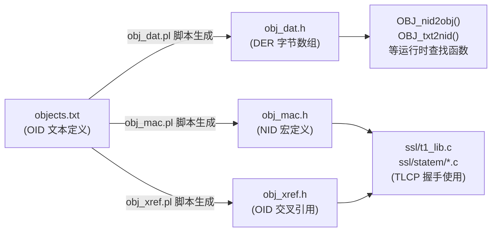

# 与TLCP相关的OID定义

> **注意**：SM OID 支持现已原生内置于 BoringSSL 中。以下文档描述了 SM 相关 OID 在 BoringSSL 中的实现结构。

TLCP（在 Tongsuo 中也称为 NTLS，对应 GB/T 38636-2020 标准）相关的 OID 定义分布在以下几个文件中，形成一套完整的 OID 管理体系。

---

## OID 定义的核心文件

### 1. `crypto/objects/objects.txt` — OID 源定义文件

这是所有 OID 的**人类可读源文件**，SM 国密相关 OID 的根节点定义如下： [1](#4-0) 

```
member-body 156         : ISO-CN        : ISO CN Member Body
ISO-CN 10197            : oscca
oscca 1                 : sm-scheme
```

这对应 OID `1.2.156.10197.1`，是所有国密算法 OID 的根。TLCP 相关的算法 OID（如 SM2、SM3、SM4 以及 `SM2-with-SM3` 签名算法）都在 `sm-scheme` 下定义。`objects.txt` 中有 46 处 SM 相关定义。

### 2. `include/openssl/obj_mac.h` — NID 宏定义文件

由 `objects.txt` 自动生成，为每个 OID 分配一个整数 NID（Numeric ID）。TLCP 相关的关键 NID 包括：

- `NID_SM2_with_SM3`（SM2 签名算法，TLCP 握手中使用）
- `NID_sm2`、`NID_sm3`、`NID_sm4` 等

该文件共有 85 处 SM 相关 NID 定义。 [2](#4-1) 

### 3. `crypto/objects/obj_dat.h` — 编译后的 OID 二进制数据

由 `objects.txt` 通过脚本生成，包含 OID 的 DER 编码字节数组和查找表，是运行时实际使用的数据。`NID_SM2_with_SM3` 等在此文件中有对应的字节编码。 [3](#4-2) 

### 4. `crypto/objects/obj_xref.h` — OID 交叉引用表

定义签名算法 OID 与其依赖的摘要算法 OID 之间的映射关系。例如 `NID_SM2_with_SM3` 与 `NID_sm3` 的关联就在此文件中，供 TLS 握手时选择摘要算法使用。

---

## TLCP 层如何使用这些 OID

TLCP 握手中 OID 的使用主要体现在以下几处：

**`ssl/t1_lib.c`**：在 TLS/NTLS 握手的签名算法协商中，使用 `NID_SM2_with_SM3` 来标识 SM2 签名算法，共有 2 处引用。

**`ssl/statem/statem_clnt.c`**：客户端握手状态机中使用 `NID_SM2_with_SM3` 处理服务端证书的签名算法验证。

**`providers/smtc/self_test.c`**：SMTC（商用密码检测）Provider 的自测试中引用 `NID_SM2_with_SM3`。

---

## 整体处理流程



---

## 关键 OID 层次结构

```
1.2.156.10197.1          (sm-scheme)
├── .501                 SM2 椭圆曲线
├── .301.1               SM2 签名算法 (SM2-with-SM3)  ← TLCP 证书签名
├── .401                 SM3 哈希算法
└── .104.x               SM4 对称加密算法
```

`NID_SM2_with_SM3` 是 TLCP 中最核心的 OID，用于标识证书签名算法，在握手时的 `CertificateVerify` 消息和证书链验证中均会用到。 [4](#4-3)

### Citations

**File:** crypto/objects/objects.txt (L42-44)
```text
member-body 156         : ISO-CN        : ISO CN Member Body
ISO-CN 10197            : oscca
oscca 1                 : sm-scheme
```

**File:** include/openssl/obj_mac.h (L1-1)
```text
/*
```

**File:** crypto/objects/obj_dat.h (L237-266)
```text
    0x2B,0x06,0x01,0x05,0x05,0x07,0x00,0x06,       /* [ 1816] OBJ_id_mod_cmc */
    0x2B,0x06,0x01,0x05,0x05,0x07,0x00,0x07,       /* [ 1824] OBJ_id_mod_kea_profile_88 */
    0x2B,0x06,0x01,0x05,0x05,0x07,0x00,0x08,       /* [ 1832] OBJ_id_mod_kea_profile_93 */
    0x2B,0x06,0x01,0x05,0x05,0x07,0x00,0x09,       /* [ 1840] OBJ_id_mod_cmp */
    0x2B,0x06,0x01,0x05,0x05,0x07,0x00,0x0A,       /* [ 1848] OBJ_id_mod_qualified_cert_88 */
    0x2B,0x06,0x01,0x05,0x05,0x07,0x00,0x0B,       /* [ 1856] OBJ_id_mod_qualified_cert_93 */
    0x2B,0x06,0x01,0x05,0x05,0x07,0x00,0x0C,       /* [ 1864] OBJ_id_mod_attribute_cert */
    0x2B,0x06,0x01,0x05,0x05,0x07,0x00,0x0D,       /* [ 1872] OBJ_id_mod_timestamp_protocol */
    0x2B,0x06,0x01,0x05,0x05,0x07,0x00,0x0E,       /* [ 1880] OBJ_id_mod_ocsp */
    0x2B,0x06,0x01,0x05,0x05,0x07,0x00,0x0F,       /* [ 1888] OBJ_id_mod_dvcs */
    0x2B,0x06,0x01,0x05,0x05,0x07,0x00,0x10,       /* [ 1896] OBJ_id_mod_cmp2000 */
    0x2B,0x06,0x01,0x05,0x05,0x07,0x01,0x02,       /* [ 1904] OBJ_biometricInfo */
    0x2B,0x06,0x01,0x05,0x05,0x07,0x01,0x03,       /* [ 1912] OBJ_qcStatements */
    0x2B,0x06,0x01,0x05,0x05,0x07,0x01,0x04,       /* [ 1920] OBJ_ac_auditEntity */
    0x2B,0x06,0x01,0x05,0x05,0x07,0x01,0x05,       /* [ 1928] OBJ_ac_targeting */
    0x2B,0x06,0x01,0x05,0x05,0x07,0x01,0x06,       /* [ 1936] OBJ_aaControls */
    0x2B,0x06,0x01,0x05,0x05,0x07,0x01,0x07,       /* [ 1944] OBJ_sbgp_ipAddrBlock */
    0x2B,0x06,0x01,0x05,0x05,0x07,0x01,0x08,       /* [ 1952] OBJ_sbgp_autonomousSysNum */
    0x2B,0x06,0x01,0x05,0x05,0x07,0x01,0x09,       /* [ 1960] OBJ_sbgp_routerIdentifier */
    0x2B,0x06,0x01,0x05,0x05,0x07,0x02,0x03,       /* [ 1968] OBJ_textNotice */
    0x2B,0x06,0x01,0x05,0x05,0x07,0x03,0x05,       /* [ 1976] OBJ_ipsecEndSystem */
    0x2B,0x06,0x01,0x05,0x05,0x07,0x03,0x06,       /* [ 1984] OBJ_ipsecTunnel */
    0x2B,0x06,0x01,0x05,0x05,0x07,0x03,0x07,       /* [ 1992] OBJ_ipsecUser */
    0x2B,0x06,0x01,0x05,0x05,0x07,0x03,0x0A,       /* [ 2000] OBJ_dvcs */
    0x2B,0x06,0x01,0x05,0x05,0x07,0x04,0x01,       /* [ 2008] OBJ_id_it_caProtEncCert */
    0x2B,0x06,0x01,0x05,0x05,0x07,0x04,0x02,       /* [ 2016] OBJ_id_it_signKeyPairTypes */
    0x2B,0x06,0x01,0x05,0x05,0x07,0x04,0x03,       /* [ 2024] OBJ_id_it_encKeyPairTypes */
    0x2B,0x06,0x01,0x05,0x05,0x07,0x04,0x04,       /* [ 2032] OBJ_id_it_preferredSymmAlg */
    0x2B,0x06,0x01,0x05,0x05,0x07,0x04,0x05,       /* [ 2040] OBJ_id_it_caKeyUpdateInfo */
    0x2B,0x06,0x01,0x05,0x05,0x07,0x04,0x06,       /* [ 2048] OBJ_id_it_currentCRL */
```

**File:** include/openssl/ntls.h (L40-78)
```text
/* GB/T 38636-2020 TLCP, cipher suites */
#  define NTLS_TXT_ECDHE_SM2_SM4_CBC_SM3        "ECDHE-SM2-SM4-CBC-SM3"
#  define NTLS_TXT_ECDHE_SM2_SM4_GCM_SM3        "ECDHE-SM2-SM4-GCM-SM3"
#  define NTLS_TXT_ECC_SM2_SM4_CBC_SM3          "ECC-SM2-SM4-CBC-SM3"
#  define NTLS_TXT_ECC_SM2_SM4_GCM_SM3          "ECC-SM2-SM4-GCM-SM3"
#  define NTLS_TXT_IBSDH_SM9_SM4_CBC_SM3        "IBSDH-SM9-SM4-CBC-SM3"
#  define NTLS_TXT_IBSDH_SM9_SM4_GCM_SM3        "IBSDH-SM9-SM4-GCM-SM3"
#  define NTLS_TXT_IBC_SM9_SM4_CBC_SM3          "IBC-SM9-SM4-CBC-SM3"
#  define NTLS_TXT_IBC_SM9_SM4_GCM_SM3          "IBC-SM9-SM4-GCM-SM3"
#  define NTLS_TXT_RSA_SM4_CBC_SM3              "RSA-SM4-CBC-SM3"
#  define NTLS_TXT_RSA_SM4_GCM_SM3              "RSA-SM4-GCM-SM3"
#  define NTLS_TXT_RSA_SM4_CBC_SHA256           "RSA-SM4-CBC-SHA256"
#  define NTLS_TXT_RSA_SM4_GCM_SHA256           "RSA-SM4-GCM-SHA256"

#  define NTLS_GB_ECDHE_SM2_SM4_CBC_SM3         "ECDHE_SM4_CBC_SM3"
#  define NTLS_GB_ECDHE_SM2_SM4_GCM_SM3         "ECDHE_SM4_GCM_SM3"
#  define NTLS_GB_ECC_SM2_SM4_CBC_SM3           "ECC_SM4_CBC_SM3"
#  define NTLS_GB_ECC_SM2_SM4_GCM_SM3           "ECC_SM4_GCM_SM3"
#  define NTLS_GB_IBSDH_SM9_SM4_CBC_SM3         "IBSDH_SM4_CBC_SM3"
#  define NTLS_GB_IBSDH_SM9_SM4_GCM_SM3         "IBSDH_SM4_GCM_SM3"
#  define NTLS_GB_IBC_SM9_SM4_CBC_SM3           "IBC_SM4_CBC_SM3"
#  define NTLS_GB_IBC_SM9_SM4_GCM_SM3           "IBC_SM4_GCM_SM3"
#  define NTLS_GB_RSA_SM4_CBC_SM3               "RSA_SM4_CBC_SM3"
#  define NTLS_GB_RSA_SM4_GCM_SM3               "RSA_SM4_GCM_SM3"
#  define NTLS_GB_RSA_SM4_CBC_SHA256            "RSA_SM4_CBC_SHA256"
#  define NTLS_GB_RSA_SM4_GCM_SHA256            "RSA_SM4_GCM_SHA256"

#  define NTLS_CK_ECDHE_SM2_SM4_CBC_SM3         0x0300E011
#  define NTLS_CK_ECDHE_SM2_SM4_GCM_SM3         0x0300E051
#  define NTLS_CK_ECC_SM2_SM4_CBC_SM3           0x0300E013
#  define NTLS_CK_ECC_SM2_SM4_GCM_SM3           0x0300E053
#  define NTLS_CK_IBSDH_SM9_SM4_CBC_SM3         0x0300E015
#  define NTLS_CK_IBSDH_SM9_SM4_GCM_SM3         0x0300E055
#  define NTLS_CK_IBC_SM9_SM4_CBC_SM3           0x0300E017
#  define NTLS_CK_IBC_SM9_SM4_GCM_SM3           0x0300E057
#  define NTLS_CK_RSA_SM4_CBC_SM3               0x0300E019
#  define NTLS_CK_RSA_SM4_GCM_SM3               0x0300E059
#  define NTLS_CK_RSA_SM4_CBC_SHA256            0x0300E01C
#  define NTLS_CK_RSA_SM4_GCM_SHA256            0x0300E05a
```
