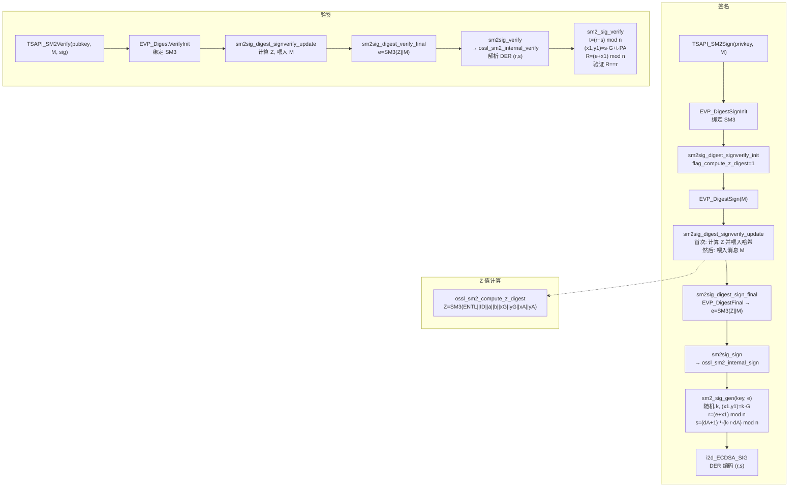

# SM2 签名与验签的完整实现流程分析。

## 整体架构层次

```
应用层 (TSAPI_SM2Sign / TSAPI_SM2Verify)
    ↓
EVP 层 (EVP_DigestSignInit / EVP_DigestSign)
    ↓
Provider 层 (sm2sig_digest_signverify_init / update / final)
    ↓
核心算法层 (ossl_sm2_internal_sign / sm2_sig_gen / sm2_sig_verify)
```

---

## 一、签名流程

### 1. 入口：`TSAPI_SM2Sign()` [1](#1-0) 

使用 SM3 作为摘要算法，调用 `EVP_DigestSignInit` + `EVP_DigestSign`，两次调用 `EVP_DigestSign`：第一次传 `NULL` 获取签名长度，第二次实际签名。

---

### 2. Provider 层：DigestSign 三段式

Provider 层通过三个函数完成签名，注册在 `ossl_sm2_signature_functions` 中： [2](#1-1) 

**初始化** `sm2sig_digest_signverify_init()`：设置 `flag_compute_z_digest = 1`，初始化摘要上下文。 [3](#1-2) 

**Update** `sm2sig_digest_signverify_update()`：**首次调用时**触发 Z 值计算并喂入哈希上下文，然后继续喂入消息数据： [4](#1-3) 

**Final** `sm2sig_digest_sign_final()`：完成哈希，得到摘要 `digest`，再调用 `sm2sig_sign()`： [5](#1-4) 

`sm2sig_sign()` 最终调用 `ossl_sm2_internal_sign(tbs, tbslen, sig, &sltmp, ctx->ec)`： [6](#1-5) 

---

### 3. 核心层：Z 值计算

SM2 签名的关键特性是引入了用户身份标识 ID，用于计算 **Z 值**（用户可辨别标识符的哈希）。

`ossl_sm2_compute_z_digest()` 计算：

```
Z = SM3(ENTL || ID || a || b || xG || yG || xA || yA)
```

其中 ENTL 是 ID 比特长度的 2 字节大端表示，a/b 是曲线参数，xG/yG 是基点坐标，xA/yA 是用户公钥坐标。若 ID 为 NULL，默认使用 `SM2_DEFAULT_USERID`。 [7](#1-6) 

---

### 4. 核心层：消息哈希 `sm2_compute_msg_hash()`

在 `ossl_sm2_do_sign()` 路径（测试/直接调用）中，消息哈希 `e` 的计算为：

```
e = SM3(Z || M)
``` [8](#1-7) 

> 注意：在 DigestSign 路径中，Z 在 `sm2sig_compute_z_digest()` 中喂入哈希上下文，消息 M 在 update 中喂入，最终 `EVP_DigestFinal` 得到同样的 `e = SM3(Z || M)`。

---

### 5. 核心层：签名生成 `sm2_sig_gen()`

对应 GM/T 0003 标准步骤 A3-A7： [9](#1-8) 

| 步骤 | 代码操作 | 说明 |
|------|----------|------|
| A3 | `BN_priv_rand_range_ex(k, order, ...)` | 随机 `k ∈ [1, n-1]` |
| A4 | `EC_POINT_mul(group, kG, k, NULL, NULL, ctx)` | 计算 `(x1, y1) = k·G` |
| A5 | `BN_mod_add(r, e, x1, order, ctx)` | `r = (e + x1) mod n`，若 r=0 或 r+k=n 则重试 |
| A6 | `s = (dA+1)⁻¹ · (k - r·dA) mod n` | 若 s=0 则重试 |
| A7 | `ECDSA_SIG_set0(sig, r, s)` + `i2d_ECDSA_SIG` | 输出 DER 编码的 `(r, s)` |

s 的计算分解为：
```c
BN_add(s, dA, 1)                    // s = dA + 1
ossl_ec_group_do_inverse_ord(s, s)  // s = (dA+1)^{-1} mod n
BN_mod_mul(tmp, dA, r, order)       // tmp = dA*r mod n
BN_sub(tmp, k, tmp)                 // tmp = k - dA*r
BN_mod_mul(s, s, tmp, order)        // s = (dA+1)^{-1} * (k - dA*r) mod n
``` [10](#1-9) 

---

## 二、验签流程

### 1. 入口：`TSAPI_SM2Verify()` [11](#1-10) 

使用 `EVP_DigestVerifyInit` + `EVP_DigestVerify`，同样绑定 SM3。

---

### 2. Provider 层 → 核心层

验签路径：`sm2sig_digest_verify_final()` → `sm2sig_verify()` → `ossl_sm2_internal_verify()`

`ossl_sm2_internal_verify()` 解析 DER 编码的签名，验证 DER 格式无尾部垃圾，然后调用 `sm2_sig_verify()`： [12](#1-11) 

---

### 3. 核心层：验签 `sm2_sig_verify()`

对应 GM/T 0003 标准步骤 B1-B7： [13](#1-12) 

| 步骤 | 代码操作 | 说明 |
|------|----------|------|
| B1-B2 | `BN_cmp(r/s, BN_value_one()) < 0 \|\| BN_cmp(order, r/s) <= 0` | 验证 r', s' ∈ [1, n-1] |
| B5 | `BN_mod_add(t, r, s, order)` | `t = (r' + s') mod n`，若 t=0 则失败 |
| B6 | `EC_POINT_mul(group, pt, s, pubkey, t, ctx)` | `(x1', y1') = s'·G + t·PA` |
| B7 | `BN_mod_add(t, e, x1, order)` 后比较 `r == t` | `R = (e' + x1') mod n`，若 R == r' 则验签通过 |

---

## 完整流程图



---

## 关键文件汇总

| 文件 | 职责 |
|------|------|
| `crypto/tsapi/tsapi_lib.c` | 高层 TSAPI 接口 `TSAPI_SM2Sign` / `TSAPI_SM2Verify` |
| `providers/implementations/signature/sm2_sig.c` | Provider 层，DigestSign 三段式，Z 值注入时机控制 |
| `crypto/sm2/sm2_sign.c` | 核心算法：Z 值计算、消息哈希、签名生成、验签 | [14](#1-13)

### Citations

**File:** crypto/tsapi/tsapi_lib.c (L824-849)
```c
int TSAPI_SM2Verify(EVP_PKEY *key, const unsigned char *tbs, size_t tbslen,
                    const unsigned char *sig, size_t siglen)
{
    int ok = 0;
    EVP_MD_CTX *ctx = NULL;

    if (key == NULL || tbs == NULL || sig == NULL) {
        ERR_raise(ERR_LIB_CRYPTO, ERR_R_PASSED_NULL_PARAMETER);
        return 0;
    }

    ctx = EVP_MD_CTX_new();
    if (ctx == NULL)
        return 0;

    if (!EVP_DigestVerifyInit(ctx, NULL, EVP_sm3(), NULL, key)
        || EVP_DigestVerify(ctx, sig, siglen, tbs, tbslen) <= 0) {
        ERR_raise(ERR_LIB_CRYPTO, ERR_R_EVP_LIB);
        goto end;
    }

    ok = 1;
end:
    EVP_MD_CTX_free(ctx);
    return ok;
}
```

**File:** crypto/tsapi/tsapi_lib.c (L851-888)
```c
unsigned char *TSAPI_SM2Sign(EVP_PKEY *key, const unsigned char *tbs,
                             size_t tbslen, size_t *siglen)
{
    unsigned char *sig = NULL;
    size_t len;
    EVP_MD_CTX *ctx = NULL;

    if (key == NULL || tbs == NULL || siglen == NULL) {
        ERR_raise(ERR_LIB_CRYPTO, ERR_R_PASSED_NULL_PARAMETER);
        return NULL;
    }

    ctx = EVP_MD_CTX_new();
    if (ctx == NULL)
        return NULL;

    if (!EVP_DigestSignInit(ctx, NULL, EVP_sm3(), NULL, key)
        || !EVP_DigestSign(ctx, NULL, &len, tbs, tbslen)) {
        ERR_raise(ERR_LIB_CRYPTO, ERR_R_EVP_LIB);
        goto end;
    }

    sig = OPENSSL_malloc(len);
    if (sig == NULL)
        goto end;

    if (!EVP_DigestSign(ctx, sig, &len, tbs, tbslen)) {
        OPENSSL_free(sig);
        *siglen = 0;
        ERR_raise(ERR_LIB_CRYPTO, ERR_R_EVP_LIB);
        goto end;
    }

    *siglen = len;
end:
    EVP_MD_CTX_free(ctx);
    return sig;
}
```

**File:** providers/implementations/signature/sm2_sig.c (L157-183)
```c
static int sm2sig_sign(void *vpsm2ctx, unsigned char *sig, size_t *siglen,
                       size_t sigsize, const unsigned char *tbs, size_t tbslen)
{
    PROV_SM2_CTX *ctx = (PROV_SM2_CTX *)vpsm2ctx;
    int ret;
    unsigned int sltmp;
    /* SM2 uses ECDSA_size as well */
    size_t ecsize = ECDSA_size(ctx->ec);

    if (sig == NULL) {
        *siglen = ecsize;
        return 1;
    }

    if (sigsize < (size_t)ecsize)
        return 0;

    if (ctx->mdsize != 0 && tbslen != ctx->mdsize)
        return 0;

    ret = ossl_sm2_internal_sign(tbs, tbslen, sig, &sltmp, ctx->ec);
    if (ret <= 0)
        return 0;

    *siglen = sltmp;
    return 1;
}
```

**File:** providers/implementations/signature/sm2_sig.c (L204-250)
```c
static int sm2sig_digest_signverify_init(void *vpsm2ctx, const char *mdname,
                                         void *ec, const OSSL_PARAM params[])
{
    PROV_SM2_CTX *ctx = (PROV_SM2_CTX *)vpsm2ctx;
    int md_nid;
    WPACKET pkt;
    int ret = 0;

    /* This default value must be assigned before it may be overridden */
    ctx->flag_compute_z_digest = 1;

    if (!sm2sig_signature_init(vpsm2ctx, ec, params)
        || !sm2sig_set_mdname(ctx, mdname))
        return ret;

    if (ctx->mdctx == NULL) {
        ctx->mdctx = EVP_MD_CTX_new();
        if (ctx->mdctx == NULL)
            goto error;
    }

    md_nid = EVP_MD_get_type(ctx->md);

    /*
     * We do not care about DER writing errors.
     * All it really means is that for some reason, there's no
     * AlgorithmIdentifier to be had, but the operation itself is
     * still valid, just as long as it's not used to construct
     * anything that needs an AlgorithmIdentifier.
     */
    ctx->aid_len = 0;
    if (WPACKET_init_der(&pkt, ctx->aid_buf, sizeof(ctx->aid_buf))
        && ossl_DER_w_algorithmIdentifier_SM2_with_MD(&pkt, -1, ctx->ec, md_nid)
        && WPACKET_finish(&pkt)) {
        WPACKET_get_total_written(&pkt, &ctx->aid_len);
        ctx->aid = WPACKET_get_curr(&pkt);
    }
    WPACKET_cleanup(&pkt);

    if (!EVP_DigestInit_ex2(ctx->mdctx, ctx->md, params))
        goto error;

    ret = 1;

 error:
    return ret;
}
```

**File:** providers/implementations/signature/sm2_sig.c (L252-283)
```c
static int sm2sig_compute_z_digest(PROV_SM2_CTX *ctx)
{
    uint8_t *z = NULL;
    int ret = 1;

    if (ctx->flag_compute_z_digest) {
        /* Only do this once */
        ctx->flag_compute_z_digest = 0;

        if ((z = OPENSSL_zalloc(ctx->mdsize)) == NULL
            /* get hashed prefix 'z' of tbs message */
            || !ossl_sm2_compute_z_digest(z, ctx->md, ctx->id, ctx->id_len,
                                          ctx->ec)
            || !EVP_DigestUpdate(ctx->mdctx, z, ctx->mdsize))
            ret = 0;
        OPENSSL_free(z);
    }

    return ret;
}

int sm2sig_digest_signverify_update(void *vpsm2ctx, const unsigned char *data,
                                    size_t datalen)
{
    PROV_SM2_CTX *psm2ctx = (PROV_SM2_CTX *)vpsm2ctx;

    if (psm2ctx == NULL || psm2ctx->mdctx == NULL)
        return 0;

    return sm2sig_compute_z_digest(psm2ctx)
        && EVP_DigestUpdate(psm2ctx->mdctx, data, datalen);
}
```

**File:** providers/implementations/signature/sm2_sig.c (L285-306)
```c
int sm2sig_digest_sign_final(void *vpsm2ctx, unsigned char *sig, size_t *siglen,
                             size_t sigsize)
{
    PROV_SM2_CTX *psm2ctx = (PROV_SM2_CTX *)vpsm2ctx;
    unsigned char digest[EVP_MAX_MD_SIZE];
    unsigned int dlen = 0;

    if (psm2ctx == NULL || psm2ctx->mdctx == NULL)
        return 0;

    /*
     * If sig is NULL then we're just finding out the sig size. Other fields
     * are ignored. Defer to sm2sig_sign.
     */
    if (sig != NULL) {
        if (!(sm2sig_compute_z_digest(psm2ctx)
              && EVP_DigestFinal_ex(psm2ctx->mdctx, digest, &dlen)))
            return 0;
    }

    return sm2sig_sign(vpsm2ctx, sig, siglen, sigsize, digest, (size_t)dlen);
}
```

**File:** providers/implementations/signature/sm2_sig.c (L547-582)
```c
const OSSL_DISPATCH ossl_sm2_signature_functions[] = {
    { OSSL_FUNC_SIGNATURE_NEWCTX, (void (*)(void))sm2sig_newctx },
    { OSSL_FUNC_SIGNATURE_SIGN_INIT, (void (*)(void))sm2sig_signature_init },
    { OSSL_FUNC_SIGNATURE_SIGN, (void (*)(void))sm2sig_sign },
    { OSSL_FUNC_SIGNATURE_VERIFY_INIT, (void (*)(void))sm2sig_signature_init },
    { OSSL_FUNC_SIGNATURE_VERIFY, (void (*)(void))sm2sig_verify },
    { OSSL_FUNC_SIGNATURE_DIGEST_SIGN_INIT,
      (void (*)(void))sm2sig_digest_signverify_init },
    { OSSL_FUNC_SIGNATURE_DIGEST_SIGN_UPDATE,
      (void (*)(void))sm2sig_digest_signverify_update },
    { OSSL_FUNC_SIGNATURE_DIGEST_SIGN_FINAL,
      (void (*)(void))sm2sig_digest_sign_final },
    { OSSL_FUNC_SIGNATURE_DIGEST_VERIFY_INIT,
      (void (*)(void))sm2sig_digest_signverify_init },
    { OSSL_FUNC_SIGNATURE_DIGEST_VERIFY_UPDATE,
      (void (*)(void))sm2sig_digest_signverify_update },
    { OSSL_FUNC_SIGNATURE_DIGEST_VERIFY_FINAL,
      (void (*)(void))sm2sig_digest_verify_final },
    { OSSL_FUNC_SIGNATURE_FREECTX, (void (*)(void))sm2sig_freectx },
    { OSSL_FUNC_SIGNATURE_DUPCTX, (void (*)(void))sm2sig_dupctx },
    { OSSL_FUNC_SIGNATURE_GET_CTX_PARAMS, (void (*)(void))sm2sig_get_ctx_params },
    { OSSL_FUNC_SIGNATURE_GETTABLE_CTX_PARAMS,
      (void (*)(void))sm2sig_gettable_ctx_params },
    { OSSL_FUNC_SIGNATURE_SET_CTX_PARAMS, (void (*)(void))sm2sig_set_ctx_params },
    { OSSL_FUNC_SIGNATURE_SETTABLE_CTX_PARAMS,
      (void (*)(void))sm2sig_settable_ctx_params },
    { OSSL_FUNC_SIGNATURE_GET_CTX_MD_PARAMS,
      (void (*)(void))sm2sig_get_ctx_md_params },
    { OSSL_FUNC_SIGNATURE_GETTABLE_CTX_MD_PARAMS,
      (void (*)(void))sm2sig_gettable_ctx_md_params },
    { OSSL_FUNC_SIGNATURE_SET_CTX_MD_PARAMS,
      (void (*)(void))sm2sig_set_ctx_md_params },
    { OSSL_FUNC_SIGNATURE_SETTABLE_CTX_MD_PARAMS,
      (void (*)(void))sm2sig_settable_ctx_md_params },
    { 0, NULL }
};
```

**File:** crypto/sm2/sm2_sign.c (L24-144)
```c
int ossl_sm2_compute_z_digest(uint8_t *out,
                              const EVP_MD *digest,
                              const uint8_t *id,
                              size_t id_len,
                              const EC_KEY *key)
{
    int rc = 0;
    const EC_GROUP *group = EC_KEY_get0_group(key);
    BN_CTX *ctx = NULL;
    EVP_MD_CTX *hash = NULL;
    BIGNUM *p = NULL;
    BIGNUM *a = NULL;
    BIGNUM *b = NULL;
    BIGNUM *xG = NULL;
    BIGNUM *yG = NULL;
    BIGNUM *xA = NULL;
    BIGNUM *yA = NULL;
    int p_bytes = 0;
    uint8_t *buf = NULL;
    uint16_t entl = 0;
    uint8_t e_byte = 0;

    hash = EVP_MD_CTX_new();
    ctx = BN_CTX_new_ex(ossl_ec_key_get_libctx(key));
    if (hash == NULL || ctx == NULL) {
        ERR_raise(ERR_LIB_SM2, ERR_R_MALLOC_FAILURE);
        goto done;
    }

    p = BN_CTX_get(ctx);
    a = BN_CTX_get(ctx);
    b = BN_CTX_get(ctx);
    xG = BN_CTX_get(ctx);
    yG = BN_CTX_get(ctx);
    xA = BN_CTX_get(ctx);
    yA = BN_CTX_get(ctx);

    if (yA == NULL) {
        ERR_raise(ERR_LIB_SM2, ERR_R_MALLOC_FAILURE);
        goto done;
    }

    if (!EVP_DigestInit(hash, digest)) {
        ERR_raise(ERR_LIB_SM2, ERR_R_EVP_LIB);
        goto done;
    }

    /* Z = h(ENTL || ID || a || b || xG || yG || xA || yA) */

    if (id == NULL) {
        id = (const uint8_t *)SM2_DEFAULT_USERID;
        id_len = strlen(SM2_DEFAULT_USERID);
    }

    if (id_len >= (UINT16_MAX / 8)) {
        /* too large */
        ERR_raise(ERR_LIB_SM2, SM2_R_ID_TOO_LARGE);
        goto done;
    }

    entl = (uint16_t)(8 * id_len);

    e_byte = entl >> 8;
    if (!EVP_DigestUpdate(hash, &e_byte, 1)) {
        ERR_raise(ERR_LIB_SM2, ERR_R_EVP_LIB);
        goto done;
    }
    e_byte = entl & 0xFF;
    if (!EVP_DigestUpdate(hash, &e_byte, 1)) {
        ERR_raise(ERR_LIB_SM2, ERR_R_EVP_LIB);
        goto done;
    }

    if (id_len > 0 && !EVP_DigestUpdate(hash, id, id_len)) {
        ERR_raise(ERR_LIB_SM2, ERR_R_EVP_LIB);
        goto done;
    }

    if (!EC_GROUP_get_curve(group, p, a, b, ctx)) {
        ERR_raise(ERR_LIB_SM2, ERR_R_EC_LIB);
        goto done;
    }

    p_bytes = BN_num_bytes(p);
    buf = OPENSSL_zalloc(p_bytes);
    if (buf == NULL) {
        ERR_raise(ERR_LIB_SM2, ERR_R_MALLOC_FAILURE);
        goto done;
    }

    if (BN_bn2binpad(a, buf, p_bytes) < 0
            || !EVP_DigestUpdate(hash, buf, p_bytes)
            || BN_bn2binpad(b, buf, p_bytes) < 0
            || !EVP_DigestUpdate(hash, buf, p_bytes)
            || !EC_POINT_get_affine_coordinates(group,
                                                EC_GROUP_get0_generator(group),
                                                xG, yG, ctx)
            || BN_bn2binpad(xG, buf, p_bytes) < 0
            || !EVP_DigestUpdate(hash, buf, p_bytes)
            || BN_bn2binpad(yG, buf, p_bytes) < 0
            || !EVP_DigestUpdate(hash, buf, p_bytes)
            || !EC_POINT_get_affine_coordinates(group,
                                                EC_KEY_get0_public_key(key),
                                                xA, yA, ctx)
            || BN_bn2binpad(xA, buf, p_bytes) < 0
            || !EVP_DigestUpdate(hash, buf, p_bytes)
            || BN_bn2binpad(yA, buf, p_bytes) < 0
            || !EVP_DigestUpdate(hash, buf, p_bytes)
            || !EVP_DigestFinal(hash, out, NULL)) {
        ERR_raise(ERR_LIB_SM2, ERR_R_INTERNAL_ERROR);
        goto done;
    }

    rc = 1;

 done:
    OPENSSL_free(buf);
    BN_CTX_free(ctx);
    EVP_MD_CTX_free(hash);
    return rc;
}
```

**File:** crypto/sm2/sm2_sign.c (L146-200)
```c
static BIGNUM *sm2_compute_msg_hash(const EVP_MD *digest,
                                    const EC_KEY *key,
                                    const uint8_t *id,
                                    const size_t id_len,
                                    const uint8_t *msg, size_t msg_len)
{
    EVP_MD_CTX *hash = EVP_MD_CTX_new();
    const int md_size = EVP_MD_get_size(digest);
    uint8_t *z = NULL;
    BIGNUM *e = NULL;
    EVP_MD *fetched_digest = NULL;
    OSSL_LIB_CTX *libctx = ossl_ec_key_get_libctx(key);
    const char *propq = ossl_ec_key_get0_propq(key);

    if (md_size < 0) {
        ERR_raise(ERR_LIB_SM2, SM2_R_INVALID_DIGEST);
        goto done;
    }

    z = OPENSSL_zalloc(md_size);
    if (hash == NULL || z == NULL) {
        ERR_raise(ERR_LIB_SM2, ERR_R_MALLOC_FAILURE);
        goto done;
    }

    fetched_digest = EVP_MD_fetch(libctx, EVP_MD_get0_name(digest), propq);
    if (fetched_digest == NULL) {
        ERR_raise(ERR_LIB_SM2, ERR_R_INTERNAL_ERROR);
        goto done;
    }

    if (!ossl_sm2_compute_z_digest(z, fetched_digest, id, id_len, key)) {
        /* SM2err already called */
        goto done;
    }

    if (!EVP_DigestInit(hash, fetched_digest)
            || !EVP_DigestUpdate(hash, z, md_size)
            || !EVP_DigestUpdate(hash, msg, msg_len)
               /* reuse z buffer to hold H(Z || M) */
            || !EVP_DigestFinal(hash, z, NULL)) {
        ERR_raise(ERR_LIB_SM2, ERR_R_EVP_LIB);
        goto done;
    }

    e = BN_bin2bn(z, md_size, NULL);
    if (e == NULL)
        ERR_raise(ERR_LIB_SM2, ERR_R_INTERNAL_ERROR);

 done:
    EVP_MD_free(fetched_digest);
    OPENSSL_free(z);
    EVP_MD_CTX_free(hash);
    return e;
}
```

**File:** crypto/sm2/sm2_sign.c (L202-315)
```c
static ECDSA_SIG *sm2_sig_gen(const EC_KEY *key, const BIGNUM *e)
{
    const BIGNUM *dA = EC_KEY_get0_private_key(key);
    const EC_GROUP *group = EC_KEY_get0_group(key);
    const BIGNUM *order = EC_GROUP_get0_order(group);
    ECDSA_SIG *sig = NULL;
    EC_POINT *kG = NULL;
    BN_CTX *ctx = NULL;
    BIGNUM *k = NULL;
    BIGNUM *rk = NULL;
    BIGNUM *r = NULL;
    BIGNUM *s = NULL;
    BIGNUM *x1 = NULL;
    BIGNUM *tmp = NULL;
    OSSL_LIB_CTX *libctx = ossl_ec_key_get_libctx(key);

    kG = EC_POINT_new(group);
    ctx = BN_CTX_new_ex(libctx);
    if (kG == NULL || ctx == NULL) {
        ERR_raise(ERR_LIB_SM2, ERR_R_MALLOC_FAILURE);
        goto done;
    }

    BN_CTX_start(ctx);
    k = BN_CTX_get(ctx);
    rk = BN_CTX_get(ctx);
    x1 = BN_CTX_get(ctx);
    tmp = BN_CTX_get(ctx);
    if (tmp == NULL) {
        ERR_raise(ERR_LIB_SM2, ERR_R_MALLOC_FAILURE);
        goto done;
    }

    /*
     * These values are returned and so should not be allocated out of the
     * context
     */
    r = BN_new();
    s = BN_new();

    if (r == NULL || s == NULL) {
        ERR_raise(ERR_LIB_SM2, ERR_R_MALLOC_FAILURE);
        goto done;
    }

    /*
     * A3: Generate a random number k in [1,n-1] using random number generators;
     * A4: Compute (x1,y1)=[k]G, and convert the type of data x1 to be integer
     *     as specified in clause 4.2.8 of GM/T 0003.1-2012;
     * A5: Compute r=(e+x1) mod n. If r=0 or r+k=n, then go to A3;
     * A6: Compute s=(1/(1+dA)*(k-r*dA)) mod n. If s=0, then go to A3;
     * A7: Convert the type of data (r,s) to be bit strings according to the details
     *     in clause 4.2.2 of GM/T 0003.1-2012. Then the signature of message M is (r,s).
     */
    for (;;) {
        if (!BN_priv_rand_range_ex(k, order, 0, ctx)) {
            ERR_raise(ERR_LIB_SM2, ERR_R_INTERNAL_ERROR);
            goto done;
        }

        if (!EC_POINT_mul(group, kG, k, NULL, NULL, ctx)
                || !EC_POINT_get_affine_coordinates(group, kG, x1, NULL,
                                                    ctx)
                || !BN_mod_add(r, e, x1, order, ctx)) {
            ERR_raise(ERR_LIB_SM2, ERR_R_INTERNAL_ERROR);
            goto done;
        }

        /* try again if r == 0 or r+k == n */
        if (BN_is_zero(r))
            continue;

        if (!BN_add(rk, r, k)) {
            ERR_raise(ERR_LIB_SM2, ERR_R_INTERNAL_ERROR);
            goto done;
        }

        if (BN_cmp(rk, order) == 0)
            continue;

        if (!BN_add(s, dA, BN_value_one())
                || !ossl_ec_group_do_inverse_ord(group, s, s, ctx)
                || !BN_mod_mul(tmp, dA, r, order, ctx)
                || !BN_sub(tmp, k, tmp)
                || !BN_mod_mul(s, s, tmp, order, ctx)) {
            ERR_raise(ERR_LIB_SM2, ERR_R_BN_LIB);
            goto done;
        }

        /* try again if s == 0 */
        if (BN_is_zero(s))
            continue;

        sig = ECDSA_SIG_new();
        if (sig == NULL) {
            ERR_raise(ERR_LIB_SM2, ERR_R_MALLOC_FAILURE);
            goto done;
        }

         /* takes ownership of r and s */
        ECDSA_SIG_set0(sig, r, s);
        break;
    }

 done:
    if (sig == NULL) {
        BN_free(r);
        BN_free(s);
    }

    BN_CTX_free(ctx);
    EC_POINT_free(kG);
    return sig;
}
```

**File:** crypto/sm2/sm2_sign.c (L317-394)
```c
static int sm2_sig_verify(const EC_KEY *key, const ECDSA_SIG *sig,
                          const BIGNUM *e)
{
    int ret = 0;
    const EC_GROUP *group = EC_KEY_get0_group(key);
    const BIGNUM *order = EC_GROUP_get0_order(group);
    BN_CTX *ctx = NULL;
    EC_POINT *pt = NULL;
    BIGNUM *t = NULL;
    BIGNUM *x1 = NULL;
    const BIGNUM *r = NULL;
    const BIGNUM *s = NULL;
    OSSL_LIB_CTX *libctx = ossl_ec_key_get_libctx(key);

    ctx = BN_CTX_new_ex(libctx);
    pt = EC_POINT_new(group);
    if (ctx == NULL || pt == NULL) {
        ERR_raise(ERR_LIB_SM2, ERR_R_MALLOC_FAILURE);
        goto done;
    }

    BN_CTX_start(ctx);
    t = BN_CTX_get(ctx);
    x1 = BN_CTX_get(ctx);
    if (x1 == NULL) {
        ERR_raise(ERR_LIB_SM2, ERR_R_MALLOC_FAILURE);
        goto done;
    }

    /*
     * B1: verify whether r' in [1,n-1], verification failed if not
     * B2: verify whether s' in [1,n-1], verification failed if not
     * B3: set M'~=ZA || M'
     * B4: calculate e'=Hv(M'~)
     * B5: calculate t = (r' + s') modn, verification failed if t=0
     * B6: calculate the point (x1', y1')=[s']G + [t]PA
     * B7: calculate R=(e'+x1') modn, verification pass if yes, otherwise failed
     */

    ECDSA_SIG_get0(sig, &r, &s);

    if (BN_cmp(r, BN_value_one()) < 0
            || BN_cmp(s, BN_value_one()) < 0
            || BN_cmp(order, r) <= 0
            || BN_cmp(order, s) <= 0) {
        ERR_raise(ERR_LIB_SM2, SM2_R_BAD_SIGNATURE);
        goto done;
    }

    if (!BN_mod_add(t, r, s, order, ctx)) {
        ERR_raise(ERR_LIB_SM2, ERR_R_BN_LIB);
        goto done;
    }

    if (BN_is_zero(t)) {
        ERR_raise(ERR_LIB_SM2, SM2_R_BAD_SIGNATURE);
        goto done;
    }

    if (!EC_POINT_mul(group, pt, s, EC_KEY_get0_public_key(key), t, ctx)
            || !EC_POINT_get_affine_coordinates(group, pt, x1, NULL, ctx)) {
        ERR_raise(ERR_LIB_SM2, ERR_R_EC_LIB);
        goto done;
    }

    if (!BN_mod_add(t, e, x1, order, ctx)) {
        ERR_raise(ERR_LIB_SM2, ERR_R_BN_LIB);
        goto done;
    }

    if (BN_cmp(r, t) == 0)
        ret = 1;

 done:
    EC_POINT_free(pt);
    BN_CTX_free(ctx);
    return ret;
}
```

**File:** crypto/sm2/sm2_sign.c (L396-439)
```c
ECDSA_SIG *ossl_sm2_do_sign(const EC_KEY *key,
                            const EVP_MD *digest,
                            const uint8_t *id,
                            const size_t id_len,
                            const uint8_t *msg, size_t msg_len)
{
    BIGNUM *e = NULL;
    ECDSA_SIG *sig = NULL;

    e = sm2_compute_msg_hash(digest, key, id, id_len, msg, msg_len);
    if (e == NULL) {
        /* SM2err already called */
        goto done;
    }

    sig = sm2_sig_gen(key, e);

 done:
    BN_free(e);
    return sig;
}

int ossl_sm2_do_verify(const EC_KEY *key,
                       const EVP_MD *digest,
                       const ECDSA_SIG *sig,
                       const uint8_t *id,
                       const size_t id_len,
                       const uint8_t *msg, size_t msg_len)
{
    BIGNUM *e = NULL;
    int ret = 0;

    e = sm2_compute_msg_hash(digest, key, id, id_len, msg, msg_len);
    if (e == NULL) {
        /* SM2err already called */
        goto done;
    }

    ret = sm2_sig_verify(key, sig, e);

 done:
    BN_free(e);
    return ret;
}
```

**File:** crypto/sm2/sm2_sign.c (L477-517)
```c
int ossl_sm2_internal_verify(const unsigned char *dgst, int dgstlen,
                             const unsigned char *sig, int sig_len,
                             EC_KEY *eckey)
{
    ECDSA_SIG *s = NULL;
    BIGNUM *e = NULL;
    const unsigned char *p = sig;
    unsigned char *der = NULL;
    int derlen = -1;
    int ret = -1;

    s = ECDSA_SIG_new();
    if (s == NULL) {
        ERR_raise(ERR_LIB_SM2, ERR_R_MALLOC_FAILURE);
        goto done;
    }
    if (d2i_ECDSA_SIG(&s, &p, sig_len) == NULL) {
        ERR_raise(ERR_LIB_SM2, SM2_R_INVALID_ENCODING);
        goto done;
    }
    /* Ensure signature uses DER and doesn't have trailing garbage */
    derlen = i2d_ECDSA_SIG(s, &der);
    if (derlen != sig_len || memcmp(sig, der, derlen) != 0) {
        ERR_raise(ERR_LIB_SM2, SM2_R_INVALID_ENCODING);
        goto done;
    }

    e = BN_bin2bn(dgst, dgstlen, NULL);
    if (e == NULL) {
        ERR_raise(ERR_LIB_SM2, ERR_R_BN_LIB);
        goto done;
    }

    ret = sm2_sig_verify(eckey, s, e);

 done:
    OPENSSL_free(der);
    BN_free(e);
    ECDSA_SIG_free(s);
    return ret;
}
```
