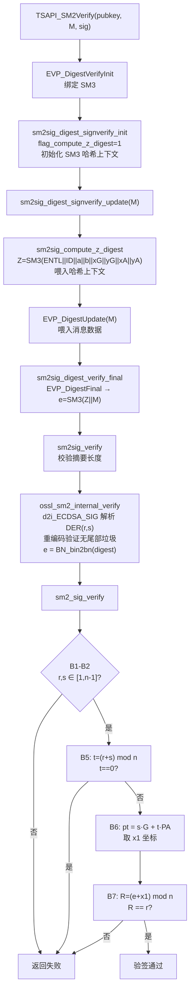

# SM2 验签流程

## 整体调用链

```
TSAPI_SM2Verify()
  → EVP_DigestVerifyInit() + EVP_DigestVerify()
    → sm2sig_digest_signverify_init()   [Provider 层 - 初始化]
    → sm2sig_digest_signverify_update() [Provider 层 - 喂入数据]
    → sm2sig_digest_verify_final()      [Provider 层 - 完成哈希]
      → sm2sig_verify()
        → ossl_sm2_internal_verify()    [核心层 - 解析签名]
          → sm2_sig_verify()            [核心层 - 验签算法]
```

---

## 一、入口：`TSAPI_SM2Verify()` [1](#2-0) 

使用 `EVP_sm3()` 绑定 SM3 摘要，调用 `EVP_DigestVerifyInit` + `EVP_DigestVerify`。`EVP_DigestVerify` 内部会依次触发 update 和 final。

---

## 二、Provider 层

### 初始化：`sm2sig_digest_signverify_init()`

与签名共用同一个初始化函数，设置 `flag_compute_z_digest = 1`，初始化摘要上下文，默认摘要为 SM3。 [2](#2-1) 

### Update：`sm2sig_digest_signverify_update()`

**首次调用时**触发 Z 值计算（`sm2sig_compute_z_digest()`），将 Z 喂入哈希上下文，然后继续喂入消息数据 M： [3](#2-2) 

Z 值的计算公式为：
```
Z = SM3(ENTL || ID || a || b || xG || yG || xA || yA)
```
其中 ENTL 是 ID 比特长度的 2 字节大端表示，a/b 是曲线参数，xG/yG 是基点坐标，xA/yA 是验签方公钥坐标。 [4](#2-3) 

### Final：`sm2sig_digest_verify_final()`

完成哈希得到摘要 `e = SM3(Z || M)`，然后调用 `sm2sig_verify()`： [5](#2-4) 

### `sm2sig_verify()`

校验摘要长度后，直接调用核心层： [6](#2-5) 

---

## 三、核心层

### `ossl_sm2_internal_verify()`：解析并校验签名格式 [7](#2-6) 

关键步骤：
1. `d2i_ECDSA_SIG()` — 将 DER 编码的签名解析为 `(r, s)` 结构
2. 重新编码并与原始字节比较，**确保无尾部垃圾数据**（防止格式攻击）
3. `BN_bin2bn(dgst, dgstlen, NULL)` — 将摘要字节转为大整数 `e`
4. 调用 `sm2_sig_verify(eckey, s, e)`

### `sm2_sig_verify()`：核心验签算法

对应 GM/T 0003 标准步骤 B1-B7： [8](#2-7) 

| 步骤 | 代码操作 | 说明 |
|------|----------|------|
| B1-B2 | `BN_cmp(r/s, BN_value_one()) < 0 \|\| BN_cmp(order, r/s) <= 0` | 验证 r', s' ∈ [1, n-1]，否则失败 |
| B4 | 已在 final 阶段完成 | e' = SM3(Z \|\| M') |
| B5 | `BN_mod_add(t, r, s, order)` | t = (r' + s') mod n，若 t=0 则失败 |
| B6 | `EC_POINT_mul(group, pt, s, pubkey, t, ctx)` | (x1', y1') = s'·G + t·PA |
| B7 | `BN_mod_add(t, e, x1, order)` 后 `BN_cmp(r, t) == 0` | R = (e' + x1') mod n，若 R == r' 则验签通过 |

---

## 完整流程图



---

## 关键设计要点

**Z 值的作用**：SM2 验签引入 Z 值将用户身份（ID）、曲线参数和公钥绑定到消息哈希中，防止跨用户/跨曲线的签名伪造攻击。默认 ID 为 `SM2_DEFAULT_USERID`（`"1234567812345678"`）。 [9](#2-8) 

**验签公式与签名公式的对应关系**：签名时 `s = (dA+1)⁻¹·(k - r·dA) mod n`，验签时用 `t = r+s` 代替 `k`，利用 `s·G + t·PA = s·G + (r+s)·dA·G = (s + r·dA + s·dA)·G = (1+dA)·s·G + r·dA·G`，最终还原出 `x1` 坐标来重建 `r`。

**DER 格式严格校验**：`ossl_sm2_internal_verify()` 中重新编码签名并与原始字节比较，防止 DER 编码的非规范形式绕过验签。 [10](#2-9) 

---

## 关键文件汇总

| 文件 | 职责 |
|------|------|
| `crypto/tsapi/tsapi_lib.c` | 高层 TSAPI 接口 `TSAPI_SM2Verify` |
| `providers/implementations/signature/sm2_sig.c` | Provider 层，DigestVerify 三段式，Z 值注入时机控制 |
| `crypto/sm2/sm2_sign.c` | 核心算法：Z 值计算、DER 解析、验签算法 `sm2_sig_verify` |

### Citations

**File:** crypto/tsapi/tsapi_lib.c (L824-849)
```c
int TSAPI_SM2Verify(EVP_PKEY *key, const unsigned char *tbs, size_t tbslen,
                    const unsigned char *sig, size_t siglen)
{
    int ok = 0;
    EVP_MD_CTX *ctx = NULL;

    if (key == NULL || tbs == NULL || sig == NULL) {
        ERR_raise(ERR_LIB_CRYPTO, ERR_R_PASSED_NULL_PARAMETER);
        return 0;
    }

    ctx = EVP_MD_CTX_new();
    if (ctx == NULL)
        return 0;

    if (!EVP_DigestVerifyInit(ctx, NULL, EVP_sm3(), NULL, key)
        || EVP_DigestVerify(ctx, sig, siglen, tbs, tbslen) <= 0) {
        ERR_raise(ERR_LIB_CRYPTO, ERR_R_EVP_LIB);
        goto end;
    }

    ok = 1;
end:
    EVP_MD_CTX_free(ctx);
    return ok;
}
```

**File:** providers/implementations/signature/sm2_sig.c (L185-194)
```c
static int sm2sig_verify(void *vpsm2ctx, const unsigned char *sig, size_t siglen,
                         const unsigned char *tbs, size_t tbslen)
{
    PROV_SM2_CTX *ctx = (PROV_SM2_CTX *)vpsm2ctx;

    if (ctx->mdsize != 0 && tbslen != ctx->mdsize)
        return 0;

    return ossl_sm2_internal_verify(tbs, tbslen, sig, siglen, ctx->ec);
}
```

**File:** providers/implementations/signature/sm2_sig.c (L204-250)
```c
static int sm2sig_digest_signverify_init(void *vpsm2ctx, const char *mdname,
                                         void *ec, const OSSL_PARAM params[])
{
    PROV_SM2_CTX *ctx = (PROV_SM2_CTX *)vpsm2ctx;
    int md_nid;
    WPACKET pkt;
    int ret = 0;

    /* This default value must be assigned before it may be overridden */
    ctx->flag_compute_z_digest = 1;

    if (!sm2sig_signature_init(vpsm2ctx, ec, params)
        || !sm2sig_set_mdname(ctx, mdname))
        return ret;

    if (ctx->mdctx == NULL) {
        ctx->mdctx = EVP_MD_CTX_new();
        if (ctx->mdctx == NULL)
            goto error;
    }

    md_nid = EVP_MD_get_type(ctx->md);

    /*
     * We do not care about DER writing errors.
     * All it really means is that for some reason, there's no
     * AlgorithmIdentifier to be had, but the operation itself is
     * still valid, just as long as it's not used to construct
     * anything that needs an AlgorithmIdentifier.
     */
    ctx->aid_len = 0;
    if (WPACKET_init_der(&pkt, ctx->aid_buf, sizeof(ctx->aid_buf))
        && ossl_DER_w_algorithmIdentifier_SM2_with_MD(&pkt, -1, ctx->ec, md_nid)
        && WPACKET_finish(&pkt)) {
        WPACKET_get_total_written(&pkt, &ctx->aid_len);
        ctx->aid = WPACKET_get_curr(&pkt);
    }
    WPACKET_cleanup(&pkt);

    if (!EVP_DigestInit_ex2(ctx->mdctx, ctx->md, params))
        goto error;

    ret = 1;

 error:
    return ret;
}
```

**File:** providers/implementations/signature/sm2_sig.c (L271-283)
```c
}

int sm2sig_digest_signverify_update(void *vpsm2ctx, const unsigned char *data,
                                    size_t datalen)
{
    PROV_SM2_CTX *psm2ctx = (PROV_SM2_CTX *)vpsm2ctx;

    if (psm2ctx == NULL || psm2ctx->mdctx == NULL)
        return 0;

    return sm2sig_compute_z_digest(psm2ctx)
        && EVP_DigestUpdate(psm2ctx->mdctx, data, datalen);
}
```

**File:** providers/implementations/signature/sm2_sig.c (L309-326)
```c
int sm2sig_digest_verify_final(void *vpsm2ctx, const unsigned char *sig,
                               size_t siglen)
{
    PROV_SM2_CTX *psm2ctx = (PROV_SM2_CTX *)vpsm2ctx;
    unsigned char digest[EVP_MAX_MD_SIZE];
    unsigned int dlen = 0;

    if (psm2ctx == NULL
        || psm2ctx->mdctx == NULL
        || EVP_MD_get_size(psm2ctx->md) > (int)sizeof(digest))
        return 0;

    if (!(sm2sig_compute_z_digest(psm2ctx)
          && EVP_DigestFinal_ex(psm2ctx->mdctx, digest, &dlen)))
        return 0;

    return sm2sig_verify(vpsm2ctx, sig, siglen, digest, (size_t)dlen);
}
```

**File:** crypto/sm2/sm2_sign.c (L24-75)
```c
int ossl_sm2_compute_z_digest(uint8_t *out,
                              const EVP_MD *digest,
                              const uint8_t *id,
                              size_t id_len,
                              const EC_KEY *key)
{
    int rc = 0;
    const EC_GROUP *group = EC_KEY_get0_group(key);
    BN_CTX *ctx = NULL;
    EVP_MD_CTX *hash = NULL;
    BIGNUM *p = NULL;
    BIGNUM *a = NULL;
    BIGNUM *b = NULL;
    BIGNUM *xG = NULL;
    BIGNUM *yG = NULL;
    BIGNUM *xA = NULL;
    BIGNUM *yA = NULL;
    int p_bytes = 0;
    uint8_t *buf = NULL;
    uint16_t entl = 0;
    uint8_t e_byte = 0;

    hash = EVP_MD_CTX_new();
    ctx = BN_CTX_new_ex(ossl_ec_key_get_libctx(key));
    if (hash == NULL || ctx == NULL) {
        ERR_raise(ERR_LIB_SM2, ERR_R_MALLOC_FAILURE);
        goto done;
    }

    p = BN_CTX_get(ctx);
    a = BN_CTX_get(ctx);
    b = BN_CTX_get(ctx);
    xG = BN_CTX_get(ctx);
    yG = BN_CTX_get(ctx);
    xA = BN_CTX_get(ctx);
    yA = BN_CTX_get(ctx);

    if (yA == NULL) {
        ERR_raise(ERR_LIB_SM2, ERR_R_MALLOC_FAILURE);
        goto done;
    }

    if (!EVP_DigestInit(hash, digest)) {
        ERR_raise(ERR_LIB_SM2, ERR_R_EVP_LIB);
        goto done;
    }

    /* Z = h(ENTL || ID || a || b || xG || yG || xA || yA) */

    if (id == NULL) {
        id = (const uint8_t *)SM2_DEFAULT_USERID;
        id_len = strlen(SM2_DEFAULT_USERID);
```

**File:** crypto/sm2/sm2_sign.c (L317-394)
```c
static int sm2_sig_verify(const EC_KEY *key, const ECDSA_SIG *sig,
                          const BIGNUM *e)
{
    int ret = 0;
    const EC_GROUP *group = EC_KEY_get0_group(key);
    const BIGNUM *order = EC_GROUP_get0_order(group);
    BN_CTX *ctx = NULL;
    EC_POINT *pt = NULL;
    BIGNUM *t = NULL;
    BIGNUM *x1 = NULL;
    const BIGNUM *r = NULL;
    const BIGNUM *s = NULL;
    OSSL_LIB_CTX *libctx = ossl_ec_key_get_libctx(key);

    ctx = BN_CTX_new_ex(libctx);
    pt = EC_POINT_new(group);
    if (ctx == NULL || pt == NULL) {
        ERR_raise(ERR_LIB_SM2, ERR_R_MALLOC_FAILURE);
        goto done;
    }

    BN_CTX_start(ctx);
    t = BN_CTX_get(ctx);
    x1 = BN_CTX_get(ctx);
    if (x1 == NULL) {
        ERR_raise(ERR_LIB_SM2, ERR_R_MALLOC_FAILURE);
        goto done;
    }

    /*
     * B1: verify whether r' in [1,n-1], verification failed if not
     * B2: verify whether s' in [1,n-1], verification failed if not
     * B3: set M'~=ZA || M'
     * B4: calculate e'=Hv(M'~)
     * B5: calculate t = (r' + s') modn, verification failed if t=0
     * B6: calculate the point (x1', y1')=[s']G + [t]PA
     * B7: calculate R=(e'+x1') modn, verification pass if yes, otherwise failed
     */

    ECDSA_SIG_get0(sig, &r, &s);

    if (BN_cmp(r, BN_value_one()) < 0
            || BN_cmp(s, BN_value_one()) < 0
            || BN_cmp(order, r) <= 0
            || BN_cmp(order, s) <= 0) {
        ERR_raise(ERR_LIB_SM2, SM2_R_BAD_SIGNATURE);
        goto done;
    }

    if (!BN_mod_add(t, r, s, order, ctx)) {
        ERR_raise(ERR_LIB_SM2, ERR_R_BN_LIB);
        goto done;
    }

    if (BN_is_zero(t)) {
        ERR_raise(ERR_LIB_SM2, SM2_R_BAD_SIGNATURE);
        goto done;
    }

    if (!EC_POINT_mul(group, pt, s, EC_KEY_get0_public_key(key), t, ctx)
            || !EC_POINT_get_affine_coordinates(group, pt, x1, NULL, ctx)) {
        ERR_raise(ERR_LIB_SM2, ERR_R_EC_LIB);
        goto done;
    }

    if (!BN_mod_add(t, e, x1, order, ctx)) {
        ERR_raise(ERR_LIB_SM2, ERR_R_BN_LIB);
        goto done;
    }

    if (BN_cmp(r, t) == 0)
        ret = 1;

 done:
    EC_POINT_free(pt);
    BN_CTX_free(ctx);
    return ret;
}
```

**File:** crypto/sm2/sm2_sign.c (L477-517)
```c
int ossl_sm2_internal_verify(const unsigned char *dgst, int dgstlen,
                             const unsigned char *sig, int sig_len,
                             EC_KEY *eckey)
{
    ECDSA_SIG *s = NULL;
    BIGNUM *e = NULL;
    const unsigned char *p = sig;
    unsigned char *der = NULL;
    int derlen = -1;
    int ret = -1;

    s = ECDSA_SIG_new();
    if (s == NULL) {
        ERR_raise(ERR_LIB_SM2, ERR_R_MALLOC_FAILURE);
        goto done;
    }
    if (d2i_ECDSA_SIG(&s, &p, sig_len) == NULL) {
        ERR_raise(ERR_LIB_SM2, SM2_R_INVALID_ENCODING);
        goto done;
    }
    /* Ensure signature uses DER and doesn't have trailing garbage */
    derlen = i2d_ECDSA_SIG(s, &der);
    if (derlen != sig_len || memcmp(sig, der, derlen) != 0) {
        ERR_raise(ERR_LIB_SM2, SM2_R_INVALID_ENCODING);
        goto done;
    }

    e = BN_bin2bn(dgst, dgstlen, NULL);
    if (e == NULL) {
        ERR_raise(ERR_LIB_SM2, ERR_R_BN_LIB);
        goto done;
    }

    ret = sm2_sig_verify(eckey, s, e);

 done:
    OPENSSL_free(der);
    BN_free(e);
    ECDSA_SIG_free(s);
    return ret;
}
```
