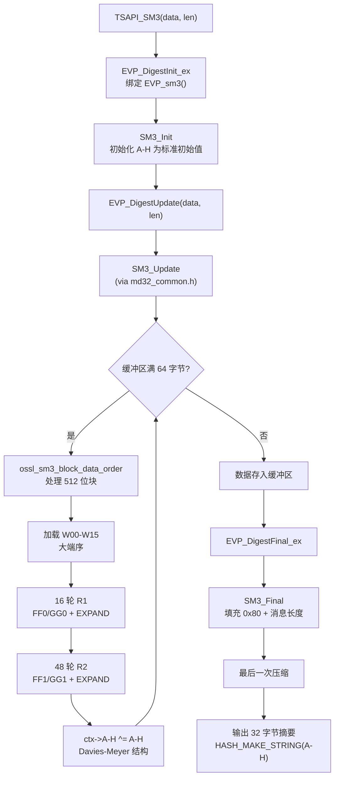

# SM3 哈希算法的实现流程

## 整体架构层次

```
TSAPI_SM3()                          [crypto/tsapi/tsapi_lib.c]
    ↓
EVP_DigestInit_ex / Update / Final   [EVP 层]
    ↓
sm3_prov.c (IMPLEMENT_digest_functions)  [Provider 层]
    ↓
SM3_Init / SM3_Update / SM3_Final    [Legacy API 层，via md32_common.h]
    ↓
ossl_sm3_block_data_order()          [核心压缩函数，crypto/sm3/sm3.c]
```

---

## 一、数据结构

`SM3_CTX` 定义在 `include/openssl/sm3.h`： [1](#5-0) 

| 字段 | 说明 |
|------|------|
| `A-H` | 8 个 32 位状态字（哈希值） |
| `Nl, Nh` | 消息总长度（位），64 位计数器 |
| `data[SM3_LBLOCK]` | 64 字节输入缓冲区（16 个 32 位字） |
| `num` | 缓冲区中当前已有的字节数 |

关键常量：`SM3_DIGEST_LENGTH = 32`（256 位输出），`SM3_CBLOCK = 64`（512 位块大小）。

---

## 二、初始化：`SM3_Init()` [2](#5-1) 

将状态字 A-H 设置为 GM/T 0004 标准规定的初始值： [3](#5-2) 

---

## 三、辅助函数与宏定义

定义在 `crypto/sm3/sm3_local.h`： [4](#5-3) 

| 宏 | 公式 | 用途 |
|----|------|------|
| `P0(X)` | X ⊕ (X<<<9) ⊕ (X<<<17) | 压缩函数中的置换 |
| `P1(X)` | X ⊕ (X<<<15) ⊕ (X<<<23) | 消息扩展中的置换 |
| `FF0(X,Y,Z)` | X ⊕ Y ⊕ Z | 前 16 轮布尔函数 |
| `FF1(X,Y,Z)` | (X∧Y) \| ((X\|Y)∧Z) | 后 48 轮多数函数 |
| `GG0(X,Y,Z)` | X ⊕ Y ⊕ Z | 前 16 轮布尔函数 |
| `GG1(X,Y,Z)` | Z ⊕ (X∧(Y⊕Z)) | 后 48 轮条件函数 |
| `EXPAND(W0,W7,W13,W3,W10)` | P1(W0⊕W7⊕(W13<<<15)) ⊕ (W3<<<7) ⊕ W10 | 消息扩展 |

`RND` 宏是单轮压缩的核心：

```c
SS1 = ROTATE(ROTATE(A,12) + E + TJ, 7)
TT1 = FF(A,B,C) + D + (SS1 ^ ROTATE(A,12)) + Wj
TT2 = GG(E,F,G) + H + SS1 + Wi
B = ROTATE(B, 9); D = TT1; F = ROTATE(F, 19); H = P0(TT2)
```

---

## 四、Update：`SM3_Update()`

通过 `sm3_local.h` 包含 `md32_common.h` 自动生成，实现 Merkle-Damgård 结构的数据收集： [5](#5-4) 

逻辑：
1. 更新消息长度计数器 `Nl/Nh`
2. 若缓冲区有残留数据，先填满 64 字节再调用压缩函数
3. 对完整的 64 字节块批量调用 `ossl_sm3_block_data_order()`
4. 剩余不足 64 字节的数据存入缓冲区

---

## 五、核心压缩函数：`ossl_sm3_block_data_order()` [6](#5-5) 

每次处理一个 512 位（64 字节）块，步骤：

1. **加载状态**：将 `ctx->A-H` 复制到局部变量
2. **加载消息字**：大端序读取 16 个 32 位字 W00-W15
3. **前 16 轮（R1）**：使用 `FF0/GG0`（XOR 函数），常量 Tj = `0x79CC4519 <<< j`，同时用 `EXPAND` 宏扩展消息字
4. **后 48 轮（R2）**：使用 `FF1/GG1`（多数/条件函数），常量 Tj = `0x9D8A7A87 <<< (j-16)`，继续扩展消息字
5. **更新状态**：`ctx->A ^= A; ... ctx->H ^= H;`（Davies-Meyer 结构） [7](#5-6) 

---

## 六、Final：`SM3_Final()` [8](#5-7) 

Merkle-Damgård 填充步骤：
1. 在消息末尾追加 `0x80`
2. 若剩余空间不足 8 字节，先压缩当前块，再开新块
3. 最后 8 字节写入消息总长度（大端，64 位）
4. 调用最后一次压缩
5. 用 `HASH_MAKE_STRING` 将 A-H 输出为 32 字节摘要（大端序）

---

## 七、Provider 层

`providers/implementations/digests/sm3_prov.c` 用一行宏注册 SM3： [9](#5-8) 

`IMPLEMENT_digest_functions` 宏自动生成 Provider 所需的 `newctx/freectx/dupctx/digest/init/update/final` 等函数。

---

## 八、Legacy 层与 TSAPI 层

`legacy_sm3.c` 提供 `EVP_sm3()` 函数，将 SM3 注册为 `NID_sm3`： [10](#5-9) 

`TSAPI_SM3()` 是最高层接口： [11](#5-10) 

---

## 九、硬件加速

在 AArch64 平台上，若 CPU 支持 ARMv8.2 SM3 指令集扩展（`ARMV8_SM3`），则自动切换到 `ossl_hwsm3_block_data_order()`，使用 `sm3ss1/sm3tt1a/sm3tt1b/sm3tt2a/sm3tt2b/sm3partw1/sm3partw2` 等硬件指令： [12](#5-11) 

---

## 完整流程图



---

## 关键文件汇总

| 文件 | 职责 |
|------|------|
| `include/openssl/sm3.h` | `SM3_CTX` 结构体，公开 API 声明 |
| `crypto/sm3/sm3_local.h` | 算法宏：P0/P1/FF/GG/EXPAND/RND/R1/R2，初始值 |
| `crypto/sm3/sm3.c` | `SM3_Init` 和核心压缩函数 `ossl_sm3_block_data_order` |
| `include/crypto/md32_common.h` | 通用 Merkle-Damgård 框架，生成 `SM3_Update/SM3_Final` |
| `providers/implementations/digests/sm3_prov.c` | Provider 层注册 |
| `crypto/sm3/legacy_sm3.c` | Legacy `EVP_sm3()` 接口 |
| `crypto/tsapi/tsapi_lib.c` | 高层 `TSAPI_SM3()` 接口 |
| `crypto/sm3/asm/sm3-armv8.pl` | AArch64 硬件加速实现 |

### Citations

**File:** include/openssl/sm3.h (L31-47)
```text
#  define SM3_DIGEST_LENGTH 32
#  define SM3_WORD unsigned int

#  define SM3_CBLOCK      64
#  define SM3_LBLOCK      (SM3_CBLOCK/4)

typedef struct SM3state_st {
   SM3_WORD A, B, C, D, E, F, G, H;
   SM3_WORD Nl, Nh;
   SM3_WORD data[SM3_LBLOCK];
   unsigned int num;
} SM3_CTX;

OSSL_DEPRECATEDIN_3_0 int SM3_Init(SM3_CTX *c);
OSSL_DEPRECATEDIN_3_0 int SM3_Update(SM3_CTX *c, const void *data, size_t len);
OSSL_DEPRECATEDIN_3_0 int SM3_Final(unsigned char *md, SM3_CTX *c);
OSSL_DEPRECATEDIN_3_0 void SM3_Transform(SM3_CTX *c, const unsigned char *data);
```

**File:** crypto/sm3/sm3.c (L16-28)
```c
int SM3_Init(SM3_CTX *c)
{
    memset(c, 0, sizeof(*c));
    c->A = SM3_A;
    c->B = SM3_B;
    c->C = SM3_C;
    c->D = SM3_D;
    c->E = SM3_E;
    c->F = SM3_F;
    c->G = SM3_G;
    c->H = SM3_H;
    return 1;
}
```

**File:** crypto/sm3/sm3.c (L30-195)
```c
void ossl_sm3_block_data_order(SM3_CTX *ctx, const void *p, size_t num)
{
    const unsigned char *data = p;
    register unsigned MD32_REG_T A, B, C, D, E, F, G, H;

    unsigned MD32_REG_T W00, W01, W02, W03, W04, W05, W06, W07,
        W08, W09, W10, W11, W12, W13, W14, W15;

    for (; num--;) {

        A = ctx->A;
        B = ctx->B;
        C = ctx->C;
        D = ctx->D;
        E = ctx->E;
        F = ctx->F;
        G = ctx->G;
        H = ctx->H;

        /*
        * We have to load all message bytes immediately since SM3 reads
        * them slightly out of order.
        */
        (void)HOST_c2l(data, W00);
        (void)HOST_c2l(data, W01);
        (void)HOST_c2l(data, W02);
        (void)HOST_c2l(data, W03);
        (void)HOST_c2l(data, W04);
        (void)HOST_c2l(data, W05);
        (void)HOST_c2l(data, W06);
        (void)HOST_c2l(data, W07);
        (void)HOST_c2l(data, W08);
        (void)HOST_c2l(data, W09);
        (void)HOST_c2l(data, W10);
        (void)HOST_c2l(data, W11);
        (void)HOST_c2l(data, W12);
        (void)HOST_c2l(data, W13);
        (void)HOST_c2l(data, W14);
        (void)HOST_c2l(data, W15);

        R1(A, B, C, D, E, F, G, H, 0x79CC4519, W00, W00 ^ W04);
        W00 = EXPAND(W00, W07, W13, W03, W10);
        R1(D, A, B, C, H, E, F, G, 0xF3988A32, W01, W01 ^ W05);
        W01 = EXPAND(W01, W08, W14, W04, W11);
        R1(C, D, A, B, G, H, E, F, 0xE7311465, W02, W02 ^ W06);
        W02 = EXPAND(W02, W09, W15, W05, W12);
        R1(B, C, D, A, F, G, H, E, 0xCE6228CB, W03, W03 ^ W07);
        W03 = EXPAND(W03, W10, W00, W06, W13);
        R1(A, B, C, D, E, F, G, H, 0x9CC45197, W04, W04 ^ W08);
        W04 = EXPAND(W04, W11, W01, W07, W14);
        R1(D, A, B, C, H, E, F, G, 0x3988A32F, W05, W05 ^ W09);
        W05 = EXPAND(W05, W12, W02, W08, W15);
        R1(C, D, A, B, G, H, E, F, 0x7311465E, W06, W06 ^ W10);
        W06 = EXPAND(W06, W13, W03, W09, W00);
        R1(B, C, D, A, F, G, H, E, 0xE6228CBC, W07, W07 ^ W11);
        W07 = EXPAND(W07, W14, W04, W10, W01);
        R1(A, B, C, D, E, F, G, H, 0xCC451979, W08, W08 ^ W12);
        W08 = EXPAND(W08, W15, W05, W11, W02);
        R1(D, A, B, C, H, E, F, G, 0x988A32F3, W09, W09 ^ W13);
        W09 = EXPAND(W09, W00, W06, W12, W03);
        R1(C, D, A, B, G, H, E, F, 0x311465E7, W10, W10 ^ W14);
        W10 = EXPAND(W10, W01, W07, W13, W04);
        R1(B, C, D, A, F, G, H, E, 0x6228CBCE, W11, W11 ^ W15);
        W11 = EXPAND(W11, W02, W08, W14, W05);
        R1(A, B, C, D, E, F, G, H, 0xC451979C, W12, W12 ^ W00);
        W12 = EXPAND(W12, W03, W09, W15, W06);
        R1(D, A, B, C, H, E, F, G, 0x88A32F39, W13, W13 ^ W01);
        W13 = EXPAND(W13, W04, W10, W00, W07);
        R1(C, D, A, B, G, H, E, F, 0x11465E73, W14, W14 ^ W02);
        W14 = EXPAND(W14, W05, W11, W01, W08);
        R1(B, C, D, A, F, G, H, E, 0x228CBCE6, W15, W15 ^ W03);
        W15 = EXPAND(W15, W06, W12, W02, W09);
        R2(A, B, C, D, E, F, G, H, 0x9D8A7A87, W00, W00 ^ W04);
        W00 = EXPAND(W00, W07, W13, W03, W10);
        R2(D, A, B, C, H, E, F, G, 0x3B14F50F, W01, W01 ^ W05);
        W01 = EXPAND(W01, W08, W14, W04, W11);
        R2(C, D, A, B, G, H, E, F, 0x7629EA1E, W02, W02 ^ W06);
        W02 = EXPAND(W02, W09, W15, W05, W12);
        R2(B, C, D, A, F, G, H, E, 0xEC53D43C, W03, W03 ^ W07);
        W03 = EXPAND(W03, W10, W00, W06, W13);
        R2(A, B, C, D, E, F, G, H, 0xD8A7A879, W04, W04 ^ W08);
        W04 = EXPAND(W04, W11, W01, W07, W14);
        R2(D, A, B, C, H, E, F, G, 0xB14F50F3, W05, W05 ^ W09);
        W05 = EXPAND(W05, W12, W02, W08, W15);
        R2(C, D, A, B, G, H, E, F, 0x629EA1E7, W06, W06 ^ W10);
        W06 = EXPAND(W06, W13, W03, W09, W00);
        R2(B, C, D, A, F, G, H, E, 0xC53D43CE, W07, W07 ^ W11);
        W07 = EXPAND(W07, W14, W04, W10, W01);
        R2(A, B, C, D, E, F, G, H, 0x8A7A879D, W08, W08 ^ W12);
        W08 = EXPAND(W08, W15, W05, W11, W02);
        R2(D, A, B, C, H, E, F, G, 0x14F50F3B, W09, W09 ^ W13);
        W09 = EXPAND(W09, W00, W06, W12, W03);
        R2(C, D, A, B, G, H, E, F, 0x29EA1E76, W10, W10 ^ W14);
        W10 = EXPAND(W10, W01, W07, W13, W04);
        R2(B, C, D, A, F, G, H, E, 0x53D43CEC, W11, W11 ^ W15);
        W11 = EXPAND(W11, W02, W08, W14, W05);
        R2(A, B, C, D, E, F, G, H, 0xA7A879D8, W12, W12 ^ W00);
        W12 = EXPAND(W12, W03, W09, W15, W06);
        R2(D, A, B, C, H, E, F, G, 0x4F50F3B1, W13, W13 ^ W01);
        W13 = EXPAND(W13, W04, W10, W00, W07);
        R2(C, D, A, B, G, H, E, F, 0x9EA1E762, W14, W14 ^ W02);
        W14 = EXPAND(W14, W05, W11, W01, W08);
        R2(B, C, D, A, F, G, H, E, 0x3D43CEC5, W15, W15 ^ W03);
        W15 = EXPAND(W15, W06, W12, W02, W09);
        R2(A, B, C, D, E, F, G, H, 0x7A879D8A, W00, W00 ^ W04);
        W00 = EXPAND(W00, W07, W13, W03, W10);
        R2(D, A, B, C, H, E, F, G, 0xF50F3B14, W01, W01 ^ W05);
        W01 = EXPAND(W01, W08, W14, W04, W11);
        R2(C, D, A, B, G, H, E, F, 0xEA1E7629, W02, W02 ^ W06);
        W02 = EXPAND(W02, W09, W15, W05, W12);
        R2(B, C, D, A, F, G, H, E, 0xD43CEC53, W03, W03 ^ W07);
        W03 = EXPAND(W03, W10, W00, W06, W13);
        R2(A, B, C, D, E, F, G, H, 0xA879D8A7, W04, W04 ^ W08);
        W04 = EXPAND(W04, W11, W01, W07, W14);
        R2(D, A, B, C, H, E, F, G, 0x50F3B14F, W05, W05 ^ W09);
        W05 = EXPAND(W05, W12, W02, W08, W15);
        R2(C, D, A, B, G, H, E, F, 0xA1E7629E, W06, W06 ^ W10);
        W06 = EXPAND(W06, W13, W03, W09, W00);
        R2(B, C, D, A, F, G, H, E, 0x43CEC53D, W07, W07 ^ W11);
        W07 = EXPAND(W07, W14, W04, W10, W01);
        R2(A, B, C, D, E, F, G, H, 0x879D8A7A, W08, W08 ^ W12);
        W08 = EXPAND(W08, W15, W05, W11, W02);
        R2(D, A, B, C, H, E, F, G, 0x0F3B14F5, W09, W09 ^ W13);
        W09 = EXPAND(W09, W00, W06, W12, W03);
        R2(C, D, A, B, G, H, E, F, 0x1E7629EA, W10, W10 ^ W14);
        W10 = EXPAND(W10, W01, W07, W13, W04);
        R2(B, C, D, A, F, G, H, E, 0x3CEC53D4, W11, W11 ^ W15);
        W11 = EXPAND(W11, W02, W08, W14, W05);
        R2(A, B, C, D, E, F, G, H, 0x79D8A7A8, W12, W12 ^ W00);
        W12 = EXPAND(W12, W03, W09, W15, W06);
        R2(D, A, B, C, H, E, F, G, 0xF3B14F50, W13, W13 ^ W01);
        W13 = EXPAND(W13, W04, W10, W00, W07);
        R2(C, D, A, B, G, H, E, F, 0xE7629EA1, W14, W14 ^ W02);
        W14 = EXPAND(W14, W05, W11, W01, W08);
        R2(B, C, D, A, F, G, H, E, 0xCEC53D43, W15, W15 ^ W03);
        W15 = EXPAND(W15, W06, W12, W02, W09);
        R2(A, B, C, D, E, F, G, H, 0x9D8A7A87, W00, W00 ^ W04);
        W00 = EXPAND(W00, W07, W13, W03, W10);
        R2(D, A, B, C, H, E, F, G, 0x3B14F50F, W01, W01 ^ W05);
        W01 = EXPAND(W01, W08, W14, W04, W11);
        R2(C, D, A, B, G, H, E, F, 0x7629EA1E, W02, W02 ^ W06);
        W02 = EXPAND(W02, W09, W15, W05, W12);
        R2(B, C, D, A, F, G, H, E, 0xEC53D43C, W03, W03 ^ W07);
        W03 = EXPAND(W03, W10, W00, W06, W13);
        R2(A, B, C, D, E, F, G, H, 0xD8A7A879, W04, W04 ^ W08);
        R2(D, A, B, C, H, E, F, G, 0xB14F50F3, W05, W05 ^ W09);
        R2(C, D, A, B, G, H, E, F, 0x629EA1E7, W06, W06 ^ W10);
        R2(B, C, D, A, F, G, H, E, 0xC53D43CE, W07, W07 ^ W11);
        R2(A, B, C, D, E, F, G, H, 0x8A7A879D, W08, W08 ^ W12);
        R2(D, A, B, C, H, E, F, G, 0x14F50F3B, W09, W09 ^ W13);
        R2(C, D, A, B, G, H, E, F, 0x29EA1E76, W10, W10 ^ W14);
        R2(B, C, D, A, F, G, H, E, 0x53D43CEC, W11, W11 ^ W15);
        R2(A, B, C, D, E, F, G, H, 0xA7A879D8, W12, W12 ^ W00);
        R2(D, A, B, C, H, E, F, G, 0x4F50F3B1, W13, W13 ^ W01);
        R2(C, D, A, B, G, H, E, F, 0x9EA1E762, W14, W14 ^ W02);
        R2(B, C, D, A, F, G, H, E, 0x3D43CEC5, W15, W15 ^ W03);

        ctx->A ^= A;
        ctx->B ^= B;
        ctx->C ^= C;
        ctx->D ^= D;
        ctx->E ^= E;
        ctx->F ^= F;
        ctx->G ^= G;
        ctx->H ^= H;
    }
```

**File:** crypto/sm3/sm3_local.h (L36-49)
```text
#if defined(OPENSSL_SM3_ASM)
# if defined(__aarch64__)
#  include "crypto/arm_arch.h"
#  define HWSM3_CAPABLE (OPENSSL_armcap_P & ARMV8_SM3)
void ossl_hwsm3_block_data_order(SM3_CTX *c, const void *p, size_t num);
# endif
#endif

#if defined(HWSM3_CAPABLE)
# define HASH_BLOCK_DATA_ORDER (HWSM3_CAPABLE ? ossl_hwsm3_block_data_order \
                                              : ossl_sm3_block_data_order)
#else
# define HASH_BLOCK_DATA_ORDER   ossl_sm3_block_data_order
#endif
```

**File:** crypto/sm3/sm3_local.h (L55-84)
```text
#define P0(X) (X ^ ROTATE(X, 9) ^ ROTATE(X, 17))
#define P1(X) (X ^ ROTATE(X, 15) ^ ROTATE(X, 23))

#define FF0(X,Y,Z) (X ^ Y ^ Z)
#define GG0(X,Y,Z) (X ^ Y ^ Z)

#define FF1(X,Y,Z) ((X & Y) | ((X | Y) & Z))
#define GG1(X,Y,Z) ((Z ^ (X & (Y ^ Z))))

#define EXPAND(W0,W7,W13,W3,W10) \
   (P1(W0 ^ W7 ^ ROTATE(W13, 15)) ^ ROTATE(W3, 7) ^ W10)

#define RND(A, B, C, D, E, F, G, H, TJ, Wi, Wj, FF, GG)           \
     do {                                                         \
       const SM3_WORD A12 = ROTATE(A, 12);                        \
       const SM3_WORD A12_SM = A12 + E + TJ;                      \
       const SM3_WORD SS1 = ROTATE(A12_SM, 7);                    \
       const SM3_WORD TT1 = FF(A, B, C) + D + (SS1 ^ A12) + (Wj); \
       const SM3_WORD TT2 = GG(E, F, G) + H + SS1 + Wi;           \
       B = ROTATE(B, 9);                                          \
       D = TT1;                                                   \
       F = ROTATE(F, 19);                                         \
       H = P0(TT2);                                               \
     } while(0)

#define R1(A,B,C,D,E,F,G,H,TJ,Wi,Wj) \
   RND(A,B,C,D,E,F,G,H,TJ,Wi,Wj,FF0,GG0)

#define R2(A,B,C,D,E,F,G,H,TJ,Wi,Wj) \
   RND(A,B,C,D,E,F,G,H,TJ,Wi,Wj,FF1,GG1)
```

**File:** crypto/sm3/sm3_local.h (L86-93)
```text
#define SM3_A 0x7380166fUL
#define SM3_B 0x4914b2b9UL
#define SM3_C 0x172442d7UL
#define SM3_D 0xda8a0600UL
#define SM3_E 0xa96f30bcUL
#define SM3_F 0x163138aaUL
#define SM3_G 0xe38dee4dUL
#define SM3_H 0xb0fb0e4eUL
```

**File:** include/crypto/md32_common.h (L132-188)
```text
int HASH_UPDATE(HASH_CTX *c, const void *data_, size_t len)
{
    const unsigned char *data = data_;
    unsigned char *p;
    HASH_LONG l;
    size_t n;

    if (len == 0)
        return 1;

    l = (c->Nl + (((HASH_LONG) len) << 3)) & 0xffffffffUL;
    if (l < c->Nl)              /* overflow */
        c->Nh++;
    c->Nh += (HASH_LONG) (len >> 29); /* might cause compiler warning on
                                       * 16-bit */
    c->Nl = l;

    n = c->num;
    if (n != 0) {
        p = (unsigned char *)c->data;

        if (len >= HASH_CBLOCK || len + n >= HASH_CBLOCK) {
            memcpy(p + n, data, HASH_CBLOCK - n);
            HASH_BLOCK_DATA_ORDER(c, p, 1);
            n = HASH_CBLOCK - n;
            data += n;
            len -= n;
            c->num = 0;
            /*
             * We use memset rather than OPENSSL_cleanse() here deliberately.
             * Using OPENSSL_cleanse() here could be a performance issue. It
             * will get properly cleansed on finalisation so this isn't a
             * security problem.
             */
            memset(p, 0, HASH_CBLOCK); /* keep it zeroed */
        } else {
            memcpy(p + n, data, len);
            c->num += (unsigned int)len;
            return 1;
        }
    }

    n = len / HASH_CBLOCK;
    if (n > 0) {
        HASH_BLOCK_DATA_ORDER(c, data, n);
        n *= HASH_CBLOCK;
        data += n;
        len -= n;
    }

    if (len != 0) {
        p = (unsigned char *)c->data;
        c->num = (unsigned int)len;
        memcpy(p, data, len);
    }
    return 1;
}
```

**File:** include/crypto/md32_common.h (L195-230)
```text
int HASH_FINAL(unsigned char *md, HASH_CTX *c)
{
    unsigned char *p = (unsigned char *)c->data;
    size_t n = c->num;

    p[n] = 0x80;                /* there is always room for one */
    n++;

    if (n > (HASH_CBLOCK - 8)) {
        memset(p + n, 0, HASH_CBLOCK - n);
        n = 0;
        HASH_BLOCK_DATA_ORDER(c, p, 1);
    }
    memset(p + n, 0, HASH_CBLOCK - 8 - n);

    p += HASH_CBLOCK - 8;
# if   defined(DATA_ORDER_IS_BIG_ENDIAN)
    (void)HOST_l2c(c->Nh, p);
    (void)HOST_l2c(c->Nl, p);
# elif defined(DATA_ORDER_IS_LITTLE_ENDIAN)
    (void)HOST_l2c(c->Nl, p);
    (void)HOST_l2c(c->Nh, p);
# endif
    p -= HASH_CBLOCK;
    HASH_BLOCK_DATA_ORDER(c, p, 1);
    c->num = 0;
    OPENSSL_cleanse(p, HASH_CBLOCK);

# ifndef HASH_MAKE_STRING
#  error "HASH_MAKE_STRING must be defined!"
# else
    HASH_MAKE_STRING(c, md);
# endif

    return 1;
}
```

**File:** providers/implementations/digests/sm3_prov.c (L17-19)
```c
IMPLEMENT_digest_functions(sm3, SM3_CTX,
                           SM3_CBLOCK, SM3_DIGEST_LENGTH, 0,
                           SM3_Init, SM3_Update, SM3_Final)
```

**File:** crypto/sm3/legacy_sm3.c (L19-32)
```c
static const EVP_MD sm3_md = {
    NID_sm3,
    NID_sm3WithRSAEncryption,
    SM3_DIGEST_LENGTH,
    0,
    EVP_ORIG_GLOBAL,
    LEGACY_EVP_MD_METH_TABLE(sm3_int_init, sm3_int_update, sm3_int_final, NULL,
                             SM3_CBLOCK),
};

const EVP_MD *EVP_sm3(void)
{
    return &sm3_md;
}
```

**File:** crypto/tsapi/tsapi_lib.c (L1287-1323)
```c
unsigned char *TSAPI_SM3(const void *data, size_t datalen, size_t *outlen)
{
    EVP_MD_CTX *ctx = NULL;
    unsigned char *out = NULL;
    unsigned int len = 0;

    if (data == NULL || outlen == NULL) {
        ERR_raise(ERR_LIB_CRYPTO, ERR_R_PASSED_NULL_PARAMETER);
        return NULL;
    }

    ctx = EVP_MD_CTX_new();
    if (ctx == NULL)
        return NULL;

    if (!EVP_DigestInit_ex(ctx, EVP_sm3(), NULL)
        || !EVP_DigestUpdate(ctx, data, datalen)) {
        ERR_raise(ERR_LIB_CRYPTO, ERR_R_EVP_LIB);
        goto end;
    }

    out = OPENSSL_malloc(EVP_MD_CTX_get_size(ctx));
    if (out == NULL)
        goto end;

    if (!EVP_DigestFinal_ex(ctx, out, &len)) {
        ERR_raise(ERR_LIB_CRYPTO, ERR_R_EVP_LIB);
        OPENSSL_free(out);
        out = NULL;
        len = 0;
    }

    *outlen = len;
end:
    EVP_MD_CTX_free(ctx);
    return out;
}
```
