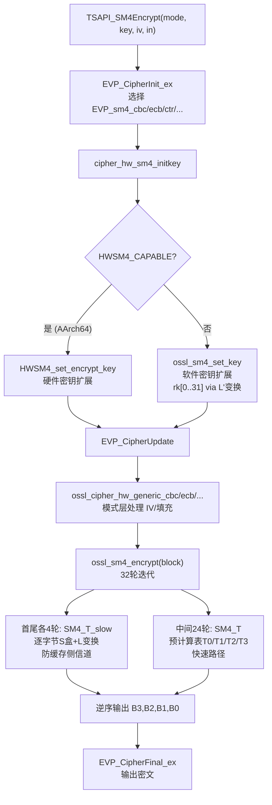

# SM4 对称加密算法在 Tongsuo 中的实现流程

---

## 整体架构层次

```
TSAPI_SM4Encrypt / TSAPI_SM4Decrypt
    ↓
EVP_CipherInit_ex / EVP_CipherUpdate / EVP_CipherFinal_ex  [EVP 层]
    ↓
IMPLEMENT_generic_cipher (ECB/CBC/CTR/OFB/CFB)             [Provider 层]
    ↓
cipher_hw_sm4_initkey → ossl_sm4_set_key                   [硬件抽象层]
    ↓
ossl_sm4_encrypt / ossl_sm4_decrypt                        [核心算法层]
```

---

## 一、数据结构

`SM4_KEY` 定义在 `include/crypto/sm4.h`： [1](#6-0) 

| 常量 | 值 | 说明 |
|------|-----|------|
| `SM4_BLOCK_SIZE` | 16 | 块大小（128 位） |
| `SM4_KEY_SCHEDULE` | 32 | 轮密钥数量 |
| `SM4_KEY.rk[32]` | — | 32 个 32 位轮密钥 |

Provider 层的上下文 `PROV_SM4_CTX` 定义在 `providers/implementations/ciphers/cipher_sm4.h`： [2](#6-1) 

---

## 二、查找表与 S 盒

`crypto/sm4/sm4.c` 中定义了两类查找表：

**`SM4_S[256]`**：原始 8 位 S 盒（非线性替换表），用于密钥扩展和防侧信道的慢速路径。 [3](#6-2) 

**`SM4_SBOX_T0/T1/T2/T3[256]`**：预计算表，将 S 盒替换与 L 线性变换合并，每个表对应输入字节的不同位置（字节 3/2/1/0），用于快速加解密路径。 [4](#6-3) 

---

## 三、T 变换（轮函数核心）

SM4 的轮函数核心是 T 变换 = 非线性变换 τ（S 盒）+ 线性变换 L。

**慢速路径 `SM4_T_slow()`**（防缓存侧信道，用于首尾两轮）：

```
τ(X): 对 X 的每个字节分别查 SM4_S 表
L(B) = B ⊕ (B<<<2) ⊕ (B<<<10) ⊕ (B<<<18) ⊕ (B<<<24)
``` [5](#6-4) 

**快速路径 `SM4_T()`**（使用预计算表，用于中间 28 轮）： [6](#6-5) 

---

## 四、密钥扩展：`ossl_sm4_set_key()` [7](#6-6) 

步骤：
1. 将 128 位密钥分为 4 个 32 位字，与系统参数 FK 异或：`K[i] = MK[i] ⊕ FK[i]`
2. 循环 32 次，每次用 L' 变换（`t ^ rotl(t,13) ^ rotl(t,23)`）生成一个轮密钥：
   ```
   X = K[(i+1)%4] ⊕ K[(i+2)%4] ⊕ K[(i+3)%4] ⊕ CK[i]
   t = τ(X)  // S盒替换
   t = t ⊕ rotl(t,13) ⊕ rotl(t,23)  // L'线性变换
   rk[i] = K[i%4] ^= t
   ```

注意密钥扩展的 L' 变换与加密的 L 变换不同（旋转量不同）。

---

## 五、加密与解密

`SM4_RNDS` 宏定义了 4 轮并行的迭代结构： [8](#6-7) 

**加密 `ossl_sm4_encrypt()`**：
- 大端序读入 4 个 32 位字 B0-B3
- 执行 32 轮：`Bi ^= T(B_{i+1} ⊕ B_{i+2} ⊕ B_{i+3} ⊕ rk[i])`
- 首尾各 4 轮用 `SM4_T_slow`（防侧信道），中间 24 轮用 `SM4_T`（预计算表）
- **逆序输出**：`(B3, B2, B1, B0)`

**解密 `ossl_sm4_decrypt()`**： [9](#6-8) 

与加密完全相同的结构，**仅轮密钥逆序使用**（`rk[31]` 到 `rk[0]`），这是 SM4 的对称性设计。

---

## 六、Provider 层

`providers/implementations/ciphers/cipher_sm4.c` 用 `IMPLEMENT_generic_cipher` 宏一次性注册所有工作模式： [10](#6-9) 

| 模式 | 块/流 | IV 长度 |
|------|-------|---------|
| ECB | block | 0 |
| CBC | block | 128 位 |
| CTR | stream | 128 位 |
| OFB | stream | 128 位 |
| CFB | stream | 128 位 |

---

## 七、硬件抽象层

`cipher_sm4_hw.c` 中的 `cipher_hw_sm4_initkey()` 在初始化时根据硬件能力选择实现路径： [11](#6-10) 

- 若 CPU 支持 `HWSM4_CAPABLE`（AArch64 ARMv8.2 SM4 指令集），使用 `HWSM4_set_encrypt_key` + `HWSM4_encrypt`，并可选 CBC/ECB/CTR 的流式硬件加速
- 否则回退到软件实现 `ossl_sm4_set_key` + `ossl_sm4_encrypt/decrypt`

---

## 八、TSAPI 层

`TSAPI_SM4Encrypt` / `TSAPI_SM4Decrypt` 通过 `do_SM4Crypt()` 封装 EVP 接口，支持 ECB/CBC/CFB/OFB/CTR 五种模式： [12](#6-11) [13](#6-12) 

---

## 完整流程图



---

## 关键文件汇总

| 文件 | 职责 |
|------|------|
| `include/crypto/sm4.h` | `SM4_KEY` 结构体，核心函数声明 |
| `crypto/sm4/sm4.c` | S 盒、预计算表、密钥扩展、加解密核心 |
| `providers/implementations/ciphers/cipher_sm4.h` | `PROV_SM4_CTX` 上下文 |
| `providers/implementations/ciphers/cipher_sm4.c` | Provider 层，注册 ECB/CBC/CTR/OFB/CFB |
| `providers/implementations/ciphers/cipher_sm4_hw.c` | 硬件抽象，软/硬件路径选择 |
| `crypto/sm4/asm/sm4-armv8.pl` | AArch64 硬件加速汇编 |
| `crypto/tsapi/tsapi_lib.c` | 高层 `TSAPI_SM4Encrypt/Decrypt` 接口 |

### Citations

**File:** include/crypto/sm4.h (L22-37)
```text
# define SM4_ENCRYPT     1
# define SM4_DECRYPT     0

# define SM4_BLOCK_SIZE    16
# define SM4_KEY_SCHEDULE  32

typedef struct SM4_KEY_st {
    uint32_t rk[SM4_KEY_SCHEDULE];
} SM4_KEY;

int ossl_sm4_set_key(const uint8_t *key, SM4_KEY *ks);

void ossl_sm4_encrypt(const uint8_t *in, uint8_t *out, const SM4_KEY *ks);

void ossl_sm4_decrypt(const uint8_t *in, uint8_t *out, const SM4_KEY *ks);

```

**File:** providers/implementations/ciphers/cipher_sm4.h (L14-20)
```text
typedef struct prov_cast_ctx_st {
    PROV_CIPHER_CTX base;      /* Must be first */
    union {
        OSSL_UNION_ALIGN;
        SM4_KEY ks;
    } ks;
} PROV_SM4_CTX;
```

**File:** crypto/sm4/sm4.c (L15-38)
```c
static const uint8_t SM4_S[256] = {
    0xD6, 0x90, 0xE9, 0xFE, 0xCC, 0xE1, 0x3D, 0xB7, 0x16, 0xB6, 0x14, 0xC2,
    0x28, 0xFB, 0x2C, 0x05, 0x2B, 0x67, 0x9A, 0x76, 0x2A, 0xBE, 0x04, 0xC3,
    0xAA, 0x44, 0x13, 0x26, 0x49, 0x86, 0x06, 0x99, 0x9C, 0x42, 0x50, 0xF4,
    0x91, 0xEF, 0x98, 0x7A, 0x33, 0x54, 0x0B, 0x43, 0xED, 0xCF, 0xAC, 0x62,
    0xE4, 0xB3, 0x1C, 0xA9, 0xC9, 0x08, 0xE8, 0x95, 0x80, 0xDF, 0x94, 0xFA,
    0x75, 0x8F, 0x3F, 0xA6, 0x47, 0x07, 0xA7, 0xFC, 0xF3, 0x73, 0x17, 0xBA,
    0x83, 0x59, 0x3C, 0x19, 0xE6, 0x85, 0x4F, 0xA8, 0x68, 0x6B, 0x81, 0xB2,
    0x71, 0x64, 0xDA, 0x8B, 0xF8, 0xEB, 0x0F, 0x4B, 0x70, 0x56, 0x9D, 0x35,
    0x1E, 0x24, 0x0E, 0x5E, 0x63, 0x58, 0xD1, 0xA2, 0x25, 0x22, 0x7C, 0x3B,
    0x01, 0x21, 0x78, 0x87, 0xD4, 0x00, 0x46, 0x57, 0x9F, 0xD3, 0x27, 0x52,
    0x4C, 0x36, 0x02, 0xE7, 0xA0, 0xC4, 0xC8, 0x9E, 0xEA, 0xBF, 0x8A, 0xD2,
    0x40, 0xC7, 0x38, 0xB5, 0xA3, 0xF7, 0xF2, 0xCE, 0xF9, 0x61, 0x15, 0xA1,
    0xE0, 0xAE, 0x5D, 0xA4, 0x9B, 0x34, 0x1A, 0x55, 0xAD, 0x93, 0x32, 0x30,
    0xF5, 0x8C, 0xB1, 0xE3, 0x1D, 0xF6, 0xE2, 0x2E, 0x82, 0x66, 0xCA, 0x60,
    0xC0, 0x29, 0x23, 0xAB, 0x0D, 0x53, 0x4E, 0x6F, 0xD5, 0xDB, 0x37, 0x45,
    0xDE, 0xFD, 0x8E, 0x2F, 0x03, 0xFF, 0x6A, 0x72, 0x6D, 0x6C, 0x5B, 0x51,
    0x8D, 0x1B, 0xAF, 0x92, 0xBB, 0xDD, 0xBC, 0x7F, 0x11, 0xD9, 0x5C, 0x41,
    0x1F, 0x10, 0x5A, 0xD8, 0x0A, 0xC1, 0x31, 0x88, 0xA5, 0xCD, 0x7B, 0xBD,
    0x2D, 0x74, 0xD0, 0x12, 0xB8, 0xE5, 0xB4, 0xB0, 0x89, 0x69, 0x97, 0x4A,
    0x0C, 0x96, 0x77, 0x7E, 0x65, 0xB9, 0xF1, 0x09, 0xC5, 0x6E, 0xC6, 0x84,
    0x18, 0xF0, 0x7D, 0xEC, 0x3A, 0xDC, 0x4D, 0x20, 0x79, 0xEE, 0x5F, 0x3E,
    0xD7, 0xCB, 0x39, 0x48
};
```

**File:** crypto/sm4/sm4.c (L43-87)
```c
static const uint32_t SM4_SBOX_T0[256] = {
    0x8ED55B5B, 0xD0924242, 0x4DEAA7A7, 0x06FDFBFB, 0xFCCF3333, 0x65E28787,
    0xC93DF4F4, 0x6BB5DEDE, 0x4E165858, 0x6EB4DADA, 0x44145050, 0xCAC10B0B,
    0x8828A0A0, 0x17F8EFEF, 0x9C2CB0B0, 0x11051414, 0x872BACAC, 0xFB669D9D,
    0xF2986A6A, 0xAE77D9D9, 0x822AA8A8, 0x46BCFAFA, 0x14041010, 0xCFC00F0F,
    0x02A8AAAA, 0x54451111, 0x5F134C4C, 0xBE269898, 0x6D482525, 0x9E841A1A,
    0x1E061818, 0xFD9B6666, 0xEC9E7272, 0x4A430909, 0x10514141, 0x24F7D3D3,
    0xD5934646, 0x53ECBFBF, 0xF89A6262, 0x927BE9E9, 0xFF33CCCC, 0x04555151,
    0x270B2C2C, 0x4F420D0D, 0x59EEB7B7, 0xF3CC3F3F, 0x1CAEB2B2, 0xEA638989,
    0x74E79393, 0x7FB1CECE, 0x6C1C7070, 0x0DABA6A6, 0xEDCA2727, 0x28082020,
    0x48EBA3A3, 0xC1975656, 0x80820202, 0xA3DC7F7F, 0xC4965252, 0x12F9EBEB,
    0xA174D5D5, 0xB38D3E3E, 0xC33FFCFC, 0x3EA49A9A, 0x5B461D1D, 0x1B071C1C,
    0x3BA59E9E, 0x0CFFF3F3, 0x3FF0CFCF, 0xBF72CDCD, 0x4B175C5C, 0x52B8EAEA,
    0x8F810E0E, 0x3D586565, 0xCC3CF0F0, 0x7D196464, 0x7EE59B9B, 0x91871616,
    0x734E3D3D, 0x08AAA2A2, 0xC869A1A1, 0xC76AADAD, 0x85830606, 0x7AB0CACA,
    0xB570C5C5, 0xF4659191, 0xB2D96B6B, 0xA7892E2E, 0x18FBE3E3, 0x47E8AFAF,
    0x330F3C3C, 0x674A2D2D, 0xB071C1C1, 0x0E575959, 0xE99F7676, 0xE135D4D4,
    0x661E7878, 0xB4249090, 0x360E3838, 0x265F7979, 0xEF628D8D, 0x38596161,
    0x95D24747, 0x2AA08A8A, 0xB1259494, 0xAA228888, 0x8C7DF1F1, 0xD73BECEC,
    0x05010404, 0xA5218484, 0x9879E1E1, 0x9B851E1E, 0x84D75353, 0x00000000,
    0x5E471919, 0x0B565D5D, 0xE39D7E7E, 0x9FD04F4F, 0xBB279C9C, 0x1A534949,
    0x7C4D3131, 0xEE36D8D8, 0x0A020808, 0x7BE49F9F, 0x20A28282, 0xD4C71313,
    0xE8CB2323, 0xE69C7A7A, 0x42E9ABAB, 0x43BDFEFE, 0xA2882A2A, 0x9AD14B4B,
    0x40410101, 0xDBC41F1F, 0xD838E0E0, 0x61B7D6D6, 0x2FA18E8E, 0x2BF4DFDF,
    0x3AF1CBCB, 0xF6CD3B3B, 0x1DFAE7E7, 0xE5608585, 0x41155454, 0x25A38686,
    0x60E38383, 0x16ACBABA, 0x295C7575, 0x34A69292, 0xF7996E6E, 0xE434D0D0,
    0x721A6868, 0x01545555, 0x19AFB6B6, 0xDF914E4E, 0xFA32C8C8, 0xF030C0C0,
    0x21F6D7D7, 0xBC8E3232, 0x75B3C6C6, 0x6FE08F8F, 0x691D7474, 0x2EF5DBDB,
    0x6AE18B8B, 0x962EB8B8, 0x8A800A0A, 0xFE679999, 0xE2C92B2B, 0xE0618181,
    0xC0C30303, 0x8D29A4A4, 0xAF238C8C, 0x07A9AEAE, 0x390D3434, 0x1F524D4D,
    0x764F3939, 0xD36EBDBD, 0x81D65757, 0xB7D86F6F, 0xEB37DCDC, 0x51441515,
    0xA6DD7B7B, 0x09FEF7F7, 0xB68C3A3A, 0x932FBCBC, 0x0F030C0C, 0x03FCFFFF,
    0xC26BA9A9, 0xBA73C9C9, 0xD96CB5B5, 0xDC6DB1B1, 0x375A6D6D, 0x15504545,
    0xB98F3636, 0x771B6C6C, 0x13ADBEBE, 0xDA904A4A, 0x57B9EEEE, 0xA9DE7777,
    0x4CBEF2F2, 0x837EFDFD, 0x55114444, 0xBDDA6767, 0x2C5D7171, 0x45400505,
    0x631F7C7C, 0x50104040, 0x325B6969, 0xB8DB6363, 0x220A2828, 0xC5C20707,
    0xF531C4C4, 0xA88A2222, 0x31A79696, 0xF9CE3737, 0x977AEDED, 0x49BFF6F6,
    0x992DB4B4, 0xA475D1D1, 0x90D34343, 0x5A124848, 0x58BAE2E2, 0x71E69797,
    0x64B6D2D2, 0x70B2C2C2, 0xAD8B2626, 0xCD68A5A5, 0xCB955E5E, 0x624B2929,
    0x3C0C3030, 0xCE945A5A, 0xAB76DDDD, 0x867FF9F9, 0xF1649595, 0x5DBBE6E6,
    0x35F2C7C7, 0x2D092424, 0xD1C61717, 0xD66FB9B9, 0xDEC51B1B, 0x94861212,
    0x78186060, 0x30F3C3C3, 0x897CF5F5, 0x5CEFB3B3, 0xD23AE8E8, 0xACDF7373,
    0x794C3535, 0xA0208080, 0x9D78E5E5, 0x56EDBBBB, 0x235E7D7D, 0xC63EF8F8,
    0x8BD45F5F, 0xE7C82F2F, 0xDD39E4E4, 0x68492121 };

```

**File:** crypto/sm4/sm4.c (L244-257)
```c
static ossl_inline uint32_t SM4_T_slow(uint32_t X)
{
    uint32_t t = 0;

    t |= ((uint32_t)SM4_S[(uint8_t)(X >> 24)]) << 24;
    t |= ((uint32_t)SM4_S[(uint8_t)(X >> 16)]) << 16;
    t |= ((uint32_t)SM4_S[(uint8_t)(X >> 8)]) << 8;
    t |= SM4_S[(uint8_t)X];

    /*
     * L linear transform
     */
    return t ^ rotl(t, 2) ^ rotl(t, 10) ^ rotl(t, 18) ^ rotl(t, 24);
}
```

**File:** crypto/sm4/sm4.c (L259-265)
```c
static ossl_inline uint32_t SM4_T(uint32_t X)
{
    return SM4_SBOX_T0[(uint8_t)(X >> 24)] ^
           SM4_SBOX_T1[(uint8_t)(X >> 16)] ^
           SM4_SBOX_T2[(uint8_t)(X >> 8)] ^
           SM4_SBOX_T3[(uint8_t)X];
}
```

**File:** crypto/sm4/sm4.c (L267-312)
```c
int ossl_sm4_set_key(const uint8_t *key, SM4_KEY *ks)
{
    /*
     * Family Key
     */
    static const uint32_t FK[4] =
        { 0xa3b1bac6, 0x56aa3350, 0x677d9197, 0xb27022dc };

    /*
     * Constant Key
     */
    static const uint32_t CK[32] = {
        0x00070E15, 0x1C232A31, 0x383F464D, 0x545B6269,
        0x70777E85, 0x8C939AA1, 0xA8AFB6BD, 0xC4CBD2D9,
        0xE0E7EEF5, 0xFC030A11, 0x181F262D, 0x343B4249,
        0x50575E65, 0x6C737A81, 0x888F969D, 0xA4ABB2B9,
        0xC0C7CED5, 0xDCE3EAF1, 0xF8FF060D, 0x141B2229,
        0x30373E45, 0x4C535A61, 0x686F767D, 0x848B9299,
        0xA0A7AEB5, 0xBCC3CAD1, 0xD8DFE6ED, 0xF4FB0209,
        0x10171E25, 0x2C333A41, 0x484F565D, 0x646B7279
    };

    uint32_t K[4];
    int i;

    K[0] = load_u32_be(key, 0) ^ FK[0];
    K[1] = load_u32_be(key, 1) ^ FK[1];
    K[2] = load_u32_be(key, 2) ^ FK[2];
    K[3] = load_u32_be(key, 3) ^ FK[3];

    for (i = 0; i != SM4_KEY_SCHEDULE; ++i) {
        uint32_t X = K[(i + 1) % 4] ^ K[(i + 2) % 4] ^ K[(i + 3) % 4] ^ CK[i];
        uint32_t t = 0;

        t |= ((uint32_t)SM4_S[(uint8_t)(X >> 24)]) << 24;
        t |= ((uint32_t)SM4_S[(uint8_t)(X >> 16)]) << 16;
        t |= ((uint32_t)SM4_S[(uint8_t)(X >> 8)]) << 8;
        t |= SM4_S[(uint8_t)X];

        t = t ^ rotl(t, 13) ^ rotl(t, 23);
        K[i % 4] ^= t;
        ks->rk[i] = K[i % 4];
    }

    return 1;
}
```

**File:** crypto/sm4/sm4.c (L314-346)
```c
#define SM4_RNDS(k0, k1, k2, k3, F)          \
      do {                                   \
         B0 ^= F(B1 ^ B2 ^ B3 ^ ks->rk[k0]); \
         B1 ^= F(B0 ^ B2 ^ B3 ^ ks->rk[k1]); \
         B2 ^= F(B0 ^ B1 ^ B3 ^ ks->rk[k2]); \
         B3 ^= F(B0 ^ B1 ^ B2 ^ ks->rk[k3]); \
      } while(0)

void ossl_sm4_encrypt(const uint8_t *in, uint8_t *out, const SM4_KEY *ks)
{
    uint32_t B0 = load_u32_be(in, 0);
    uint32_t B1 = load_u32_be(in, 1);
    uint32_t B2 = load_u32_be(in, 2);
    uint32_t B3 = load_u32_be(in, 3);

    /*
     * Uses byte-wise sbox in the first and last rounds to provide some
     * protection from cache based side channels.
     */
    SM4_RNDS( 0,  1,  2,  3, SM4_T_slow);
    SM4_RNDS( 4,  5,  6,  7, SM4_T);
    SM4_RNDS( 8,  9, 10, 11, SM4_T);
    SM4_RNDS(12, 13, 14, 15, SM4_T);
    SM4_RNDS(16, 17, 18, 19, SM4_T);
    SM4_RNDS(20, 21, 22, 23, SM4_T);
    SM4_RNDS(24, 25, 26, 27, SM4_T);
    SM4_RNDS(28, 29, 30, 31, SM4_T_slow);

    store_u32_be(B3, out);
    store_u32_be(B2, out + 4);
    store_u32_be(B1, out + 8);
    store_u32_be(B0, out + 12);
}
```

**File:** crypto/sm4/sm4.c (L348-368)
```c
void ossl_sm4_decrypt(const uint8_t *in, uint8_t *out, const SM4_KEY *ks)
{
    uint32_t B0 = load_u32_be(in, 0);
    uint32_t B1 = load_u32_be(in, 1);
    uint32_t B2 = load_u32_be(in, 2);
    uint32_t B3 = load_u32_be(in, 3);

    SM4_RNDS(31, 30, 29, 28, SM4_T_slow);
    SM4_RNDS(27, 26, 25, 24, SM4_T);
    SM4_RNDS(23, 22, 21, 20, SM4_T);
    SM4_RNDS(19, 18, 17, 16, SM4_T);
    SM4_RNDS(15, 14, 13, 12, SM4_T);
    SM4_RNDS(11, 10,  9,  8, SM4_T);
    SM4_RNDS( 7,  6,  5,  4, SM4_T);
    SM4_RNDS( 3,  2,  1,  0, SM4_T_slow);

    store_u32_be(B3, out);
    store_u32_be(B2, out + 4);
    store_u32_be(B1, out + 8);
    store_u32_be(B0, out + 12);
}
```

**File:** providers/implementations/ciphers/cipher_sm4.c (L45-54)
```c
/* ossl_sm4128ecb_functions */
IMPLEMENT_generic_cipher(sm4, SM4, ecb, ECB, 0, 128, 128, 0, block)
/* ossl_sm4128cbc_functions */
IMPLEMENT_generic_cipher(sm4, SM4, cbc, CBC, 0, 128, 128, 128, block)
/* ossl_sm4128ctr_functions */
IMPLEMENT_generic_cipher(sm4, SM4, ctr, CTR, 0, 128, 8, 128, stream)
/* ossl_sm4128ofb128_functions */
IMPLEMENT_generic_cipher(sm4, SM4, ofb128, OFB, 0, 128, 8, 128, stream)
/* ossl_sm4128cfb128_functions */
IMPLEMENT_generic_cipher(sm4, SM4, cfb128,  CFB, 0, 128, 8, 128, stream)
```

**File:** providers/implementations/ciphers/cipher_sm4_hw.c (L12-72)
```c
static int cipher_hw_sm4_initkey(PROV_CIPHER_CTX *ctx,
                                 const unsigned char *key, size_t keylen)
{
    PROV_SM4_CTX *sctx =  (PROV_SM4_CTX *)ctx;
    SM4_KEY *ks = &sctx->ks.ks;

    ctx->ks = ks;
    if (ctx->enc
            || (ctx->mode != EVP_CIPH_ECB_MODE
                && ctx->mode != EVP_CIPH_CBC_MODE)) {
#ifdef HWSM4_CAPABLE
        if (HWSM4_CAPABLE) {
            HWSM4_set_encrypt_key(key, ks);
            ctx->block = (block128_f)HWSM4_encrypt;
            ctx->stream.cbc = NULL;
#ifdef HWSM4_cbc_encrypt
            if (ctx->mode == EVP_CIPH_CBC_MODE)
                ctx->stream.cbc = (cbc128_f)HWSM4_cbc_encrypt;
            else
#endif
#ifdef HWSM4_ecb_encrypt
            if (ctx->mode == EVP_CIPH_ECB_MODE)
                ctx->stream.ecb = (ecb128_f)HWSM4_ecb_encrypt;
            else
#endif
#ifdef HWSM4_ctr32_encrypt_blocks
            if (ctx->mode == EVP_CIPH_CTR_MODE)
                ctx->stream.ctr = (ctr128_f)HWSM4_ctr32_encrypt_blocks;
            else
#endif
            (void)0;            /* terminate potentially open 'else' */
        } else
#endif
        {
            ossl_sm4_set_key(key, ks);
            ctx->block = (block128_f)ossl_sm4_encrypt;
        }
    } else {
#ifdef HWSM4_CAPABLE
        if (HWSM4_CAPABLE) {
            HWSM4_set_decrypt_key(key, ks);
            ctx->block = (block128_f)HWSM4_decrypt;
            ctx->stream.cbc = NULL;
#ifdef HWSM4_cbc_encrypt
            if (ctx->mode == EVP_CIPH_CBC_MODE)
                ctx->stream.cbc = (cbc128_f)HWSM4_cbc_encrypt;
#endif
#ifdef HWSM4_ecb_encrypt
            if (ctx->mode == EVP_CIPH_ECB_MODE)
                ctx->stream.ecb = (ecb128_f)HWSM4_ecb_encrypt;
#endif
        } else
#endif
        {
            ossl_sm4_set_key(key, ks);
            ctx->block = (block128_f)ossl_sm4_decrypt;
        }
    }

    return 1;
}
```

**File:** crypto/tsapi/tsapi_lib.c (L1142-1205)
```c
static unsigned char *do_SM4Crypt(int mode, int enc,
                                  const unsigned char *key,
                                  size_t keylen, int isk,
                                  const unsigned char *iv,
                                  const unsigned char *in, size_t inlen,
                                  size_t *outlen)
{
# ifdef SDF_LIB
    void *hDeviceHandle = NULL;
    void *hSessionHandle = NULL;
    void *hkeyHandle = NULL;
    OSSL_ECCCipher *ecc = NULL;
# endif
    const EVP_CIPHER *cipher = NULL;
    EVP_CIPHER_CTX *ctx = NULL;
    unsigned char *outbuf = NULL;
    unsigned int len = 0;
    int lenf = 0;
    size_t max_out_len;

    if (isk < 0) {
        ctx = EVP_CIPHER_CTX_new();
        if (ctx == NULL)
            return 0;

        if (mode == OSSL_SGD_MODE_ECB)
            cipher = EVP_sm4_ecb();
        else if (mode == OSSL_SGD_MODE_CBC)
            cipher = EVP_sm4_cbc();
        else if (mode == OSSL_SGD_MODE_CFB)
            cipher = EVP_sm4_cfb();
        else if (mode == OSSL_SGD_MODE_OFB)
            cipher = EVP_sm4_ofb();
        else if (mode == OSSL_SGD_MODE_CTR)
            cipher = EVP_sm4_ctr();
        else
            goto end;

        if (!EVP_CipherInit_ex(ctx, cipher, NULL, key, iv, enc)
            || !EVP_CIPHER_CTX_set_padding(ctx, 0))
            goto end;

        max_out_len = inlen + EVP_CIPHER_CTX_get_block_size(ctx);

        outbuf = OPENSSL_malloc(max_out_len);
        if (outbuf == NULL)
            goto end;

        if (!EVP_CipherUpdate(ctx, outbuf, (int *)&len, in, inlen)) {
            OPENSSL_free(outbuf);
            outbuf = NULL;
            len = 0;
            goto end;
        }

        if (!EVP_CipherFinal_ex(ctx, outbuf + len, &lenf)) {
            OPENSSL_free(outbuf);
            outbuf = NULL;
            len = 0;
            goto end;
        }

        len += lenf;
    }
```

**File:** crypto/tsapi/tsapi_lib.c (L1267-1283)
```c
unsigned char *TSAPI_SM4Decrypt(int mode, const unsigned char *key,
                                size_t keylen, int isk,
                                const unsigned char *iv,
                                const unsigned char *in, size_t inlen,
                                size_t *outlen)
{
    return do_SM4Crypt(mode, 0, key, keylen, isk, iv, in, inlen, outlen);
}

unsigned char *TSAPI_SM4Encrypt(int mode, const unsigned char *key,
                                size_t keylen, int isk,
                                const unsigned char *iv,
                                const unsigned char *in, size_t inlen,
                                size_t *outlen)
{
    return do_SM4Crypt(mode, 1, key, keylen, isk, iv, in, inlen, outlen);
}
```
