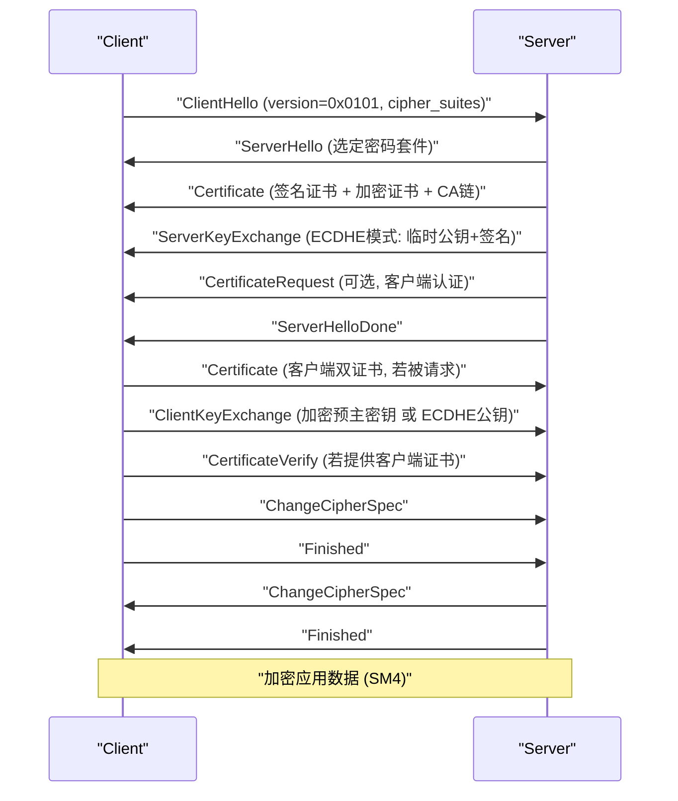

# TLCP协议实现分析

以下是 Tongsuo 中 TLCP（Transport Layer Cryptography Protocol，GB/T 38636-2020）协议实现的完整分析。在代码中，TLCP 以 **NTLS**（National TLS）命名。

---

## 一、整体架构

NTLS 作为独立的协议实现，与标准 TLS 并行存在，共享底层记录层和密码学基础设施。

```
应用层 API (SSL_CTX / SSL)
    ↓
ssl/methods.c → NTLS_METHOD (版本 0x0101)
    ↓
ssl/statem_ntls/ntls_statem.c  [核心状态机调度]
    ↙                    ↘
ntls_statem_clnt.c      ntls_statem_srvr.c
[客户端状态机]           [服务端状态机]
    ↘                    ↙
ntls_statem_lib.c  [公共函数]
    ↓
EVP API → SM2 / SM3 / SM4
``` [1](#7-0) 

---

## 二、版本与密码套件

### 版本号

NTLS 版本号为 `NTLS1_1_VERSION = 0x0101`，通过 `SSL_connection_is_ntls()` 检测连接是否为 NTLS： [2](#7-1) 

### 密码套件

定义在 `include/openssl/ntls.h`，支持三类密钥交换：

| 密码套件 | 密钥交换 | 认证 | 加密 | MAC |
|---------|---------|------|------|-----|
| `ECC-SM2-SM4-CBC-SM3` | SM2 静态 | SM2 | SM4-CBC | SM3 |
| `ECC-SM2-SM4-GCM-SM3` | SM2 静态 | SM2 | SM4-GCM | SM3 |
| `ECDHE-SM2-SM4-CBC-SM3` | SM2 ECDHE | SM2 | SM4-CBC | SM3 |
| `ECDHE-SM2-SM4-GCM-SM3` | SM2 ECDHE | SM2 | SM4-GCM | SM3 |
| `RSA-SM4-CBC-SM3` | RSA | RSA | SM4-CBC | SM3 |
| `RSA-SM4-GCM-SHA256` | RSA | RSA | SM4-GCM | SHA256 | [3](#7-2) 

密码套件的密钥交换标志在 `ssl/ssl_lib.c` 中设置： [4](#7-3) 

---

## 三、NTLS 核心特性：双证书机制

TLCP 最显著的特性是**双证书**：每个端点持有两张独立的 SM2 证书：
- **签名证书**（Sign Cert）：用于身份认证和数字签名
- **加密证书**（Enc Cert）：用于密钥交换中的加密操作

配置示例（来自测试文件）：
```
SignCertificate = server_sign.crt
SignPrivateKey  = server_sign.key
EncCertificate  = server_enc.crt
EncPrivateKey   = server_enc.key
``` [5](#7-4) 

### 双证书的发送

`ssl_add_cert_chain_ntls()` 在 Certificate 消息中依次写入签名证书和加密证书，再附加 CA 链： [6](#7-5) 

---

## 四、握手流程

### 完整握手时序



### 状态机

服务端消息构造函数映射（`ossl_statem_server_construct_message_ntls`）： [7](#7-6) 

---

## 五、密钥交换实现

### 5.1 ECC 模式（`SSL_kSM2`）：静态 SM2 加密

客户端用服务端**加密证书**的公钥加密预主密钥（48字节，前2字节为版本号）： [8](#7-7) 

服务端用加密证书私钥解密： [9](#7-8) 

关键点：`peer_chain[1]` 是服务端加密证书，`peer_chain[0]` 是签名证书。

### 5.2 ECDHE 模式（`SSL_kSM2DHE`）：SM2 ECDHE 密钥协商

服务端生成临时 SM2 密钥对，发送公钥并用签名证书私钥签名： [10](#7-9) 

客户端生成临时密钥对，调用 `ssl_derive_ntls()` 执行 SM2 密钥协商： [11](#7-10) 

### 5.3 SM2 ECDHE 密钥派生：`ssl_derive_ntls()`

这是 ECDHE 模式的核心，实现 SM2 密钥交换协议（需要双方的加密证书参与）： [12](#7-11) 

关键参数：
- **服务端为 initiator（Z_A）**，客户端为 responder（Z_B）
- 需要己方加密证书私钥（`SSL_PKEY_SM2_ENC`）和对端加密证书公钥
- 使用 SM3 作为 KDF 摘要
- 默认 ID：`"1234567812345678"`

---

## 六、主密钥生成与密钥块派生

### 预主密钥 → 主密钥

客户端在 `tls_client_key_exchange_post_work_ntls()` 中调用 `ssl_generate_master_secret()`： [13](#7-12) 

主密钥生成使用 TLS PRF（`tls1_generate_master_secret`）：

```
master_secret = PRF(pre_master_secret, "master secret",
                    ClientRandom || ServerRandom)[0..47]
``` [14](#7-13) 

### 加密方法表

NTLS 使用 `NTLS_enc_data`，复用 TLS 1.2 的加密函数： [15](#7-14) 

---

## 七、证书验证（CertificateVerify）

服务端验证客户端签名时，对 SM2 证书需要设置特殊的 SM2 ID（`HANDSHAKE_SM2_ID`）： [16](#7-15) 

---

## 八、Finished 消息

与 TLS 1.2 相同，使用 PRF 计算：

```
verify_data = PRF(master_secret, "client finished" | "server finished",
                  Hash(handshake_messages))[0..11]
``` [17](#7-16) 

---

## 九、关键文件汇总

| 文件 | 职责 |
|------|------|
| `ssl/statem_ntls/ntls_statem.c` | 核心状态机调度 |
| `ssl/statem_ntls/ntls_statem_clnt.c` | 客户端握手消息构造/处理 |
| `ssl/statem_ntls/ntls_statem_srvr.c` | 服务端握手消息构造/处理 |
| `ssl/statem_ntls/ntls_statem_lib.c` | 公共函数：双证书发送、密钥派生、Finished |
| `ssl/statem_ntls/ntls_ssl_local.h` | NTLS 本地头文件，SM2 默认 ID |
| `ssl/statem_ntls/ntls_extensions*.c` | TLS 扩展处理（SNI、ALPN 等） |
| `ssl/t1_lib.c` | `NTLS_enc_data` 加密方法表 |
| `include/openssl/ntls.h` | 密码套件常量定义 |

### Citations

**File:** ssl/statem_ntls/README.md (L1-42)
```markdown
NTLS State Machine Design
=========================

This file provides some guidance on the thinking behind the design of the
state machine code to aid future maintenance.

The message flow state machine is divided into a reading sub-state machine and a
writing sub-state machine. See the source comments in ntls_statem.c for a more
detailed description of the various states and transitions possible.

Conceptually the state machine component is designed as follows:

                          libssl
                             |
    -------------------------|-----ntls_statem.h------------------------------------
                             |
                      _______V____________________
                     |                            |
                     |    ntls_statem.c           |
                     |                            |
                     |    Core state machine code |
                     |____________________________|
    ntls_statem_local.h     ^          ^
                   _________|          |_______
                  |                            |
     _____________|____________   _____________|____________
    |                          | |                          |
    | ntls_statem_clnt.c       | | ntls_statem_srvr.c       |
    |                          | |                          |
    | NTLS client specific     | | NTLS server specific     |
    | state machine code       | | state machine code       |
    |__________________________| |__________________________|
                      |                   |
                      |                   |
                      |                   |
                 _____V___________________V___
                |                             |
                | ntls_statem_lib.c           |
                |                             |
                | Non core functions common   |
                | to both servers and clients |
                |_____________________________|
```

**File:** ssl/statem_ntls/ntls_statem_lib.c (L275-366)
```c
MSG_PROCESS_RETURN tls_process_cert_verify_ntls(SSL *s, PACKET *pkt)
{
    EVP_PKEY *pkey = NULL;
    const unsigned char *data;
    MSG_PROCESS_RETURN ret = MSG_PROCESS_ERROR;
    int j;
    unsigned int len;
    X509 *peer;
    const EVP_MD *md = NULL;
    size_t hdatalen = 0;
    void *hdata;
    EVP_MD_CTX *mctx = EVP_MD_CTX_new();
    EVP_MD_CTX *mctx2 = EVP_MD_CTX_new();
    EVP_PKEY_CTX *pctx = NULL;
    unsigned char out[EVP_MAX_MD_SIZE];
    size_t outlen = 0;

    if (mctx == NULL || mctx2 == NULL) {
        SSLfatal_ntls(s, SSL_AD_INTERNAL_ERROR, ERR_R_MALLOC_FAILURE);
        goto err;
    }

    /* For NTLS server, s->session->peer stores the client signing certificate */
    peer = s->session->peer;
    pkey = X509_get0_pubkey(peer);
    if (pkey == NULL) {
        SSLfatal_ntls(s, SSL_AD_INTERNAL_ERROR, ERR_R_INTERNAL_ERROR);
        goto err;
    }

    if (ssl_cert_lookup_by_pkey(pkey, NULL) == NULL) {
        SSLfatal_ntls(s, SSL_AD_ILLEGAL_PARAMETER,
                      SSL_R_SIGNATURE_FOR_NON_SIGNING_CERTIFICATE);
        goto err;
    }

    if (!tls1_set_peer_legacy_sigalg(s, pkey)) {
        SSLfatal_ntls(s, SSL_AD_INTERNAL_ERROR, ERR_R_INTERNAL_ERROR);
        goto err;
    }

    if (!tls1_lookup_md(s->ctx, s->s3.tmp.peer_sigalg, &md)) {
        SSLfatal_ntls(s, SSL_AD_INTERNAL_ERROR, ERR_R_INTERNAL_ERROR);
        goto err;
    }

    if (!PACKET_get_net_2(pkt, &len)) {
        SSLfatal_ntls(s, SSL_AD_DECODE_ERROR, SSL_R_LENGTH_MISMATCH);
        goto err;
    }

    if (!PACKET_get_bytes(pkt, &data, len)) {
        SSLfatal_ntls(s, SSL_AD_DECODE_ERROR, SSL_R_LENGTH_MISMATCH);
        goto err;
    }

    if (!get_cert_verify_tbs_data_ntls(s, &hdata, &hdatalen)) {
        /* SSLfatal_ntls() already called */
        goto err;
    }

    OSSL_TRACE1(TLS, "Using client verify alg %s\n",
                md == NULL ? "n/a" : EVP_MD_get0_name(md));

#ifndef OPENSSL_NO_SM2
    if (EVP_PKEY_is_sm2(pkey))  {
        if (!EVP_PKEY_set_alias_type(pkey, EVP_PKEY_SM2)) {
            SSLfatal_ntls(s, SSL_AD_INTERNAL_ERROR, ERR_R_INTERNAL_ERROR);
            goto err;
        }

        if (pkey != NULL) {
            pctx = EVP_PKEY_CTX_new_from_pkey(s->ctx->libctx, pkey, s->ctx->propq);
            if (pctx == NULL) {
                SSLfatal_ntls(s, SSL_AD_INTERNAL_ERROR, ERR_R_INTERNAL_ERROR);
                goto err;
            }

            if (EVP_PKEY_CTX_set1_id(pctx, HANDSHAKE_SM2_ID,
                                     HANDSHAKE_SM2_ID_LEN) != 1) {
                SSLfatal_ntls(s, SSL_AD_INTERNAL_ERROR, ERR_R_EVP_LIB);
                goto err;
            }

            EVP_MD_CTX_set_pkey_ctx(mctx, pctx);
        }

        if (!EVP_PKEY_set_alias_type(pkey, EVP_PKEY_EC)) {
            SSLfatal_ntls(s, SSL_AD_INTERNAL_ERROR, ERR_R_INTERNAL_ERROR);
            goto err;
        }
    }
```

**File:** ssl/statem_ntls/ntls_statem_lib.c (L415-477)
```c
int tls_construct_finished_ntls(SSL *s, WPACKET *pkt)
{
    size_t finish_md_len;
    const char *sender;
    size_t slen;

    /* This is a real handshake so make sure we clean it up at the end */
    if (!s->server && s->post_handshake_auth != SSL_PHA_REQUESTED)
        s->statem.cleanuphand = 1;

    if (s->server) {
        sender = s->method->ssl3_enc->server_finished_label;
        slen = s->method->ssl3_enc->server_finished_label_len;
    } else {
        sender = s->method->ssl3_enc->client_finished_label;
        slen = s->method->ssl3_enc->client_finished_label_len;
    }

    finish_md_len = s->method->ssl3_enc->final_finish_mac(s,
                                                          sender, slen,
                                                          s->s3.tmp.finish_md);
    if (finish_md_len == 0) {
        /* SSLfatal_ntls() already called */
        return 0;
    }

    s->s3.tmp.finish_md_len = finish_md_len;

    if (!WPACKET_memcpy(pkt, s->s3.tmp.finish_md, finish_md_len)) {
        SSLfatal_ntls(s, SSL_AD_INTERNAL_ERROR, ERR_R_INTERNAL_ERROR);
        return 0;
    }

    /*
     * Log the master secret, if logging is enabled. We don't log it for
     * TLSv1.3: there's a different key schedule for that.
     */
    if (!ssl_log_secret(s, MASTER_SECRET_LABEL,
                        s->session->master_key,
                        s->session->master_key_length)) {
        /* SSLfatal_ntls() already called */
        return 0;
    }

    /*
     * Copy the finished so we can use it for renegotiation checks
     */
    if (!ossl_assert(finish_md_len <= EVP_MAX_MD_SIZE)) {
        SSLfatal_ntls(s, SSL_AD_INTERNAL_ERROR, ERR_R_INTERNAL_ERROR);
        return 0;
    }
    if (!s->server) {
        memcpy(s->s3.previous_client_finished, s->s3.tmp.finish_md,
               finish_md_len);
        s->s3.previous_client_finished_len = finish_md_len;
    } else {
        memcpy(s->s3.previous_server_finished, s->s3.tmp.finish_md,
               finish_md_len);
        s->s3.previous_server_finished_len = finish_md_len;
    }

    return 1;
}
```

**File:** ssl/statem_ntls/ntls_statem_lib.c (L624-744)
```c
/* Add certificate chain to provided WPACKET */
static int ssl_add_cert_chain_ntls(SSL *s, WPACKET *pkt,
                                   CERT_PKEY *a_cpk, CERT_PKEY *k_cpk)
{
    int i, chain_count;
    X509 *x;
    STACK_OF(X509) *extra_certs;
    STACK_OF(X509) *chain = NULL;
    X509_STORE *chain_store;

    if (a_cpk == NULL || a_cpk->x509 == NULL
        || k_cpk == NULL || k_cpk->x509 == NULL)
        return 1;

    if (a_cpk->chain != NULL)
        extra_certs = a_cpk->chain;
    else if (k_cpk->chain != NULL)
        extra_certs = k_cpk->chain;
    else
        extra_certs = s->ctx->extra_certs;

    if ((s->mode & SSL_MODE_NO_AUTO_CHAIN) || extra_certs)
        chain_store = NULL;
    else if (s->cert->chain_store)
        chain_store = s->cert->chain_store;
    else
        chain_store = s->ctx->cert_store;

    if (chain_store != NULL) {
        X509_STORE_CTX *xs_ctx = X509_STORE_CTX_new_ex(s->ctx->libctx,
                                                       s->ctx->propq);

        if (xs_ctx == NULL) {
            SSLfatal_ntls(s, SSL_AD_INTERNAL_ERROR, ERR_R_MALLOC_FAILURE);
            return 0;
        }

        if (!X509_STORE_CTX_init(xs_ctx, chain_store,
                                 a_cpk->x509, NULL)) {
            X509_STORE_CTX_free(xs_ctx);
            SSLfatal_ntls(s, SSL_AD_INTERNAL_ERROR, ERR_R_X509_LIB);
            return 0;
        }
        /*
         * It is valid for the chain not to be complete (because normally we
         * don't include the root cert in the chain). Therefore we deliberately
         * ignore the error return from this call. We're not actually verifying
         * the cert - we're just building as much of the chain as we can
         */
        (void)X509_verify_cert(xs_ctx);
        /* Don't leave errors in the queue */
        ERR_clear_error();
        chain = X509_STORE_CTX_get0_chain(xs_ctx);
        i = ssl_security_cert_chain(s, chain, NULL, 0);
        if (i != 1) {
#if 0
            /* Dummy error calls so mkerr generates them */
            ERR_raise(ERR_LIB_SSL, SSL_R_EE_KEY_TOO_SMALL);
            ERR_raise(ERR_LIB_SSL, SSL_R_CA_KEY_TOO_SMALL);
            ERR_raise(ERR_LIB_SSL, SSL_R_CA_MD_TOO_WEAK);
#endif
            X509_STORE_CTX_free(xs_ctx);
            SSLfatal_ntls(s, SSL_AD_INTERNAL_ERROR, i);
            return 0;
        }

        /* add sign certificate */
        if (!ssl_add_cert_to_wpacket_ntls(s, pkt, a_cpk->x509)) {
            /* SSLfatal_ntls() already called */
            X509_STORE_CTX_free(xs_ctx);
            return 0;
        }

        /* add encryption certificate */
        if (!ssl_add_cert_to_wpacket_ntls(s, pkt, k_cpk->x509)) {
            /* SSLfatal_ntls() already called */
            X509_STORE_CTX_free(xs_ctx);
            return 0;
        }

        chain_count = sk_X509_num(chain);
        for (i = 1; i < chain_count; i++) {
            x = sk_X509_value(chain, i);
            if (!ssl_add_cert_to_wpacket_ntls(s, pkt, x)) {
                /* SSLfatal_ntls() already called */
                X509_STORE_CTX_free(xs_ctx);
                return 0;
            }
        }
        X509_STORE_CTX_free(xs_ctx);
    } else {
        i = ssl_security_cert_chain(s, extra_certs, a_cpk->x509, 0);
        if (i != 1) {
            SSLfatal_ntls(s, SSL_AD_INTERNAL_ERROR, i);
            return 0;
        }

        /* add sign certificate */
        if (!ssl_add_cert_to_wpacket_ntls(s, pkt, a_cpk->x509)) {
            /* SSLfatal_ntls() already called */
            return 0;
        }

        /* add encryption certificate */
        if (!ssl_add_cert_to_wpacket_ntls(s, pkt, k_cpk->x509)) {
            /* SSLfatal_ntls() already called */
            return 0;
        }

        /* output the following chain */
        for (i = 0; i < sk_X509_num(extra_certs); i++) {
            x = sk_X509_value(extra_certs, i);
            if (!ssl_add_cert_to_wpacket_ntls(s, pkt, x)) {
                /* SSLfatal_ntls() already called */
                return 0;
            }
        }
    }

    return 1;
}
```

**File:** ssl/statem_ntls/ntls_statem_lib.c (L1641-1739)
```c
int ssl_derive_ntls(SSL *s, EVP_PKEY *privkey, EVP_PKEY *pubkey, int gensecret)
{
    int rv = 0;
    int idx = 1;
    X509 *peer_x509 = NULL;
    EVP_PKEY *peer_cert_pub = NULL;
    EVP_PKEY *cert_priv = NULL;
    unsigned char *pms = NULL;
    size_t pmslen = SSL_MAX_MASTER_KEY_LENGTH;
    EVP_PKEY_CTX *pctx = NULL;
    OSSL_PARAM params[8], *p = params;

    if (privkey == NULL || pubkey == NULL) {
        SSLfatal_ntls(s, SSL_AD_INTERNAL_ERROR, ERR_R_INTERNAL_ERROR);
        return 0;
    }

    /* SM2 requires to use the private key in encryption certificate */
    cert_priv = s->cert->pkeys[SSL_PKEY_SM2_ENC].privatekey;
    if (cert_priv == NULL) {
        SSLfatal_ntls(s, SSL_AD_INTERNAL_ERROR, ERR_R_INTERNAL_ERROR);
        return 0;
    }

    /*
     * XXX:
     *
     * For NTLS server side, s->session->peer stores the client signing
     * certificate and s->session->peer_chain is an one-item stack which
     * stores the client encryption certificate.
     *
     * We need to get the client encryption certificate at this stage,
     * so we use index 0 in peer_chain.
     *
     * For client side of NTLS, the peer is an reference of the first element
     * of the two-item stack stored in s->session->peer_chain, which is the
     * signing certificate of server. So we need to get the second certificate
     * in this scenario for encryption usage.
     */
    if (s->server)
        idx = 0;

    if (s->session->peer_chain == NULL
        || (peer_x509 = sk_X509_value(s->session->peer_chain, idx)) == NULL
        || (peer_cert_pub = X509_get0_pubkey(peer_x509)) == NULL) {
        SSLfatal_ntls(s, SSL_AD_INTERNAL_ERROR, ERR_R_INTERNAL_ERROR);
        return 0;
    }

    pms = OPENSSL_malloc(pmslen);
    if (pms == NULL) {
        SSLfatal_ntls(s, SSL_AD_INTERNAL_ERROR, ERR_R_MALLOC_FAILURE);
        goto err;
    }

    pctx = EVP_PKEY_CTX_new_from_pkey(s->ctx->libctx, privkey, s->ctx->propq);

    /* for NTLS, server is initiator(Z_A), client is responder(Z_B) */
    *p++ = OSSL_PARAM_construct_int(OSSL_EXCHANGE_PARAM_INITIATOR,
                                    &s->server);
    *p++ = OSSL_PARAM_construct_octet_string(OSSL_EXCHANGE_PARAM_SELF_ID,
                                             SM2_DEFAULT_ID,
                                             SM2_DEFAULT_ID_LEN);
    *p++ = OSSL_PARAM_construct_octet_string(OSSL_EXCHANGE_PARAM_PEER_ID,
                                             SM2_DEFAULT_ID,
                                             SM2_DEFAULT_ID_LEN);
    *p++ = OSSL_PARAM_construct_octet_ptr(OSSL_EXCHANGE_PARAM_SELF_ENC_KEY,
                                          (void **)&cert_priv,
                                          sizeof(cert_priv));
    *p++ = OSSL_PARAM_construct_octet_ptr(OSSL_EXCHANGE_PARAM_PEER_ENC_KEY,
                                          (void **)&peer_cert_pub,
                                          sizeof(peer_cert_pub));
    *p++ = OSSL_PARAM_construct_utf8_string(OSSL_EXCHANGE_PARAM_DIGEST,
                                            "SM3", 0);
    *p++ = OSSL_PARAM_construct_size_t(OSSL_EXCHANGE_PARAM_OUTLEN, &pmslen);
    *p = OSSL_PARAM_construct_end();

    if (EVP_PKEY_derive_init_ex(pctx, params) <= 0
        || EVP_PKEY_derive_set_peer(pctx, pubkey) <= 0
        || EVP_PKEY_derive(pctx, pms, &pmslen) <= 0) {
        SSLfatal_ntls(s, SSL_AD_INTERNAL_ERROR, ERR_R_INTERNAL_ERROR);
        goto err;
    }

    if (gensecret) {
        rv = ssl_gensecret(s, pms, pmslen);
    } else {
        /* Save premaster secret */
        s->s3.tmp.pms = pms;
        s->s3.tmp.pmslen = pmslen;
        pms = NULL;
        rv = 1;
    }

err:
    OPENSSL_clear_free(pms, pmslen);
    EVP_PKEY_CTX_free(pctx);
    return rv;
}
```

**File:** ssl/statem_ntls/ntls_statem_lib.c (L1741-1765)
```c
int SSL_connection_is_ntls(SSL *s, int is_server)
{
    int ret = 0;
    unsigned int version;
    uint8_t *p, *data = NULL;

    /*
     * For client, or sometimes ssl_version is fixed,
     * we can easily determine if version is NTLS
     */
    if (s->version == NTLS1_1_VERSION)
        return 1;

    if (is_server) {
        /* After receiving client hello and before choosing server version,
         * get version from s->clienthello->legacy_version
         */
        if (s->clienthello)
            return s->clienthello->legacy_version == NTLS1_1_VERSION;

        if (s->preread_len >= sizeof(s->preread_buf)) {
            p = &s->preread_buf[1];
            n2s(p, version);
            return version == NTLS1_1_VERSION;
        }
```

**File:** include/openssl/ntls.h (L40-78)
```text
/* GB/T 38636-2020 TLCP, cipher suites */
#  define NTLS_TXT_ECDHE_SM2_SM4_CBC_SM3        "ECDHE-SM2-SM4-CBC-SM3"
#  define NTLS_TXT_ECDHE_SM2_SM4_GCM_SM3        "ECDHE-SM2-SM4-GCM-SM3"
#  define NTLS_TXT_ECC_SM2_SM4_CBC_SM3          "ECC-SM2-SM4-CBC-SM3"
#  define NTLS_TXT_ECC_SM2_SM4_GCM_SM3          "ECC-SM2-SM4-GCM-SM3"
#  define NTLS_TXT_IBSDH_SM9_SM4_CBC_SM3        "IBSDH-SM9-SM4-CBC-SM3"
#  define NTLS_TXT_IBSDH_SM9_SM4_GCM_SM3        "IBSDH-SM9-SM4-GCM-SM3"
#  define NTLS_TXT_IBC_SM9_SM4_CBC_SM3          "IBC-SM9-SM4-CBC-SM3"
#  define NTLS_TXT_IBC_SM9_SM4_GCM_SM3          "IBC-SM9-SM4-GCM-SM3"
#  define NTLS_TXT_RSA_SM4_CBC_SM3              "RSA-SM4-CBC-SM3"
#  define NTLS_TXT_RSA_SM4_GCM_SM3              "RSA-SM4-GCM-SM3"
#  define NTLS_TXT_RSA_SM4_CBC_SHA256           "RSA-SM4-CBC-SHA256"
#  define NTLS_TXT_RSA_SM4_GCM_SHA256           "RSA-SM4-GCM-SHA256"

#  define NTLS_GB_ECDHE_SM2_SM4_CBC_SM3         "ECDHE_SM4_CBC_SM3"
#  define NTLS_GB_ECDHE_SM2_SM4_GCM_SM3         "ECDHE_SM4_GCM_SM3"
#  define NTLS_GB_ECC_SM2_SM4_CBC_SM3           "ECC_SM4_CBC_SM3"
#  define NTLS_GB_ECC_SM2_SM4_GCM_SM3           "ECC_SM4_GCM_SM3"
#  define NTLS_GB_IBSDH_SM9_SM4_CBC_SM3         "IBSDH_SM4_CBC_SM3"
#  define NTLS_GB_IBSDH_SM9_SM4_GCM_SM3         "IBSDH_SM4_GCM_SM3"
#  define NTLS_GB_IBC_SM9_SM4_CBC_SM3           "IBC_SM4_CBC_SM3"
#  define NTLS_GB_IBC_SM9_SM4_GCM_SM3           "IBC_SM4_GCM_SM3"
#  define NTLS_GB_RSA_SM4_CBC_SM3               "RSA_SM4_CBC_SM3"
#  define NTLS_GB_RSA_SM4_GCM_SM3               "RSA_SM4_GCM_SM3"
#  define NTLS_GB_RSA_SM4_CBC_SHA256            "RSA_SM4_CBC_SHA256"
#  define NTLS_GB_RSA_SM4_GCM_SHA256            "RSA_SM4_GCM_SHA256"

#  define NTLS_CK_ECDHE_SM2_SM4_CBC_SM3         0x0300E011
#  define NTLS_CK_ECDHE_SM2_SM4_GCM_SM3         0x0300E051
#  define NTLS_CK_ECC_SM2_SM4_CBC_SM3           0x0300E013
#  define NTLS_CK_ECC_SM2_SM4_GCM_SM3           0x0300E053
#  define NTLS_CK_IBSDH_SM9_SM4_CBC_SM3         0x0300E015
#  define NTLS_CK_IBSDH_SM9_SM4_GCM_SM3         0x0300E055
#  define NTLS_CK_IBC_SM9_SM4_CBC_SM3           0x0300E017
#  define NTLS_CK_IBC_SM9_SM4_GCM_SM3           0x0300E057
#  define NTLS_CK_RSA_SM4_CBC_SM3               0x0300E019
#  define NTLS_CK_RSA_SM4_GCM_SM3               0x0300E059
#  define NTLS_CK_RSA_SM4_CBC_SHA256            0x0300E01C
#  define NTLS_CK_RSA_SM4_GCM_SHA256            0x0300E05a
```

**File:** ssl/ssl_lib.c (L3795-3807)
```c
#ifndef OPENSSL_NO_NTLS
    if (sm2_sign)
        mask_a |= SSL_aSM2;

    if (sm2_enc)
        mask_k |= SSL_kSM2 | SSL_kSM2DHE;

    if (ntls_rsa_sign)
        mask_a |= SSL_aRSA;

    if (ntls_rsa_enc)
        mask_k |= SSL_kRSA;
#endif
```

**File:** test/ntls-tests/31-ntls.cnf.in (L91-111)
```text
            "SignPrivateKey" => test_pem("sm2", "server_sign.key"),
            "EncCertificate" => test_pem("sm2", "server_enc.crt"),
            "EncPrivateKey" => test_pem("sm2", "server_enc.key"),
            "VerifyCAFile" => test_pem("sm2", "chain-ca.crt"),
            "Enable_ntls" => "on",
        },
        client => {
            "SignCertificate" => test_pem("sm2", "client_sign.crt"),
            "SignPrivateKey" => test_pem("sm2", "client_sign.key"),
            "EncCertificate" => test_pem("sm2", "client_enc.crt"),
            "EncPrivateKey" => test_pem("sm2", "client_enc.key"),
            "CipherString" => "ECDHE-SM2-SM4-CBC-SM3",
            "VerifyCAFile" => test_pem("sm2", "chain-ca.crt"),
            "Enable_ntls" => "on",
        },
        test   => {
            "Method" => "NTLS",
            "ExpectedResult" => "Success",
            "ExpectedCipher" => "ECDHE-SM2-SM4-CBC-SM3",
            "ExpectedProtocol" => "NTLS",
        },
```

**File:** ssl/statem_ntls/ntls_statem_srvr.c (L498-567)
```c
int ossl_statem_server_construct_message_ntls(SSL *s, WPACKET *pkt,
                                         confunc_f *confunc, int *mt)
{
    OSSL_STATEM *st = &s->statem;

    switch (st->hand_state) {
    default:
        /* Shouldn't happen */
        SSLfatal_ntls(s, SSL_AD_INTERNAL_ERROR, SSL_R_BAD_HANDSHAKE_STATE);
        return 0;

    case TLS_ST_SW_CHANGE:
        *confunc = tls_construct_change_cipher_spec_ntls;
        *mt = SSL3_MT_CHANGE_CIPHER_SPEC;
        break;

    case TLS_ST_SW_HELLO_REQ:
        /* No construction function needed */
        *confunc = NULL;
        *mt = SSL3_MT_HELLO_REQUEST;
        break;

    case TLS_ST_SW_SRVR_HELLO:
        *confunc = tls_construct_server_hello_ntls;
        *mt = SSL3_MT_SERVER_HELLO;
        break;

    case TLS_ST_SW_CERT:
        *confunc = tls_construct_server_certificate_ntls;
        *mt = SSL3_MT_CERTIFICATE;
        break;

    case TLS_ST_SW_KEY_EXCH:
        *confunc = tls_construct_server_key_exchange_ntls;
        *mt = SSL3_MT_SERVER_KEY_EXCHANGE;
        break;

    case TLS_ST_SW_CERT_REQ:
        *confunc = tls_construct_certificate_request_ntls;
        *mt = SSL3_MT_CERTIFICATE_REQUEST;
        break;

    case TLS_ST_SW_SRVR_DONE:
        *confunc = tls_construct_server_done_ntls;
        *mt = SSL3_MT_SERVER_DONE;
        break;

    case TLS_ST_SW_SESSION_TICKET:
        *confunc = tls_construct_new_session_ticket_ntls;
        *mt = SSL3_MT_NEWSESSION_TICKET;
        break;

    case TLS_ST_SW_CERT_STATUS:
        *confunc = tls_construct_cert_status_ntls;
        *mt = SSL3_MT_CERTIFICATE_STATUS;
        break;

    case TLS_ST_SW_FINISHED:
        *confunc = tls_construct_finished_ntls;
        *mt = SSL3_MT_FINISHED;
        break;

    case TLS_ST_EARLY_DATA:
        *confunc = NULL;
        *mt = SSL3_MT_DUMMY;
        break;
    }

    return 1;
}
```

**File:** ssl/statem_ntls/ntls_statem_srvr.c (L1583-1665)
```c
int tls_construct_server_key_exchange_ntls(SSL *s, WPACKET *pkt)
{
    unsigned char *encodedPoint = NULL;
    size_t encodedlen = 0;
    uint16_t curve_id = 0;
    const SIGALG_LOOKUP *lu = s->s3.tmp.sigalg;
    unsigned long type;
    EVP_MD_CTX *md_ctx = EVP_MD_CTX_new();
    EVP_PKEY_CTX *pctx = NULL;
    size_t paramlen = 0, paramoffset;
    int ret = 0;

    if (!WPACKET_get_total_written(pkt, &paramoffset)) {
        SSLfatal_ntls(s, SSL_AD_INTERNAL_ERROR, ERR_R_INTERNAL_ERROR);
        goto err;
    }

    type = s->s3.tmp.new_cipher->algorithm_mkey;

    if (type & SSL_kSM2DHE) {
        if (s->s3.tmp.pkey != NULL) {
            SSLfatal_ntls(s, SSL_AD_INTERNAL_ERROR, ERR_R_INTERNAL_ERROR);
            goto err;
        }

        /* Get NID of appropriate shared curve */
        curve_id = tls1_shared_group(s, -2);
        if (curve_id == 0) {
            SSLfatal_ntls(s, SSL_AD_HANDSHAKE_FAILURE,
                          SSL_R_UNSUPPORTED_ELLIPTIC_CURVE);
            goto err;
        }
        /* Cache the group used in the SSL_SESSION */
        s->session->kex_group = curve_id;
        /* Generate a new key for this curve */
        s->s3.tmp.pkey = ssl_generate_pkey_group(s, curve_id);
        if (s->s3.tmp.pkey == NULL) {
            /* SSLfatal() already called */
            goto err;
        }

        /* Encode the public key. */
        encodedlen = EVP_PKEY_get1_encoded_public_key(s->s3.tmp.pkey,
                                                      &encodedPoint);
        if (encodedlen == 0) {
            SSLfatal_ntls(s, SSL_AD_INTERNAL_ERROR, ERR_R_EVP_LIB);
            goto err;
        }
        /*
         * We only support named (not generic) curves. In this situation, the
         * ServerKeyExchange message has: [1 byte CurveType], [2 byte CurveName]
         * [1 byte length of encoded point], followed by the actual encoded
         * point itself
         */
        if (!WPACKET_put_bytes_u8(pkt, NAMED_CURVE_TYPE)
                || !WPACKET_put_bytes_u8(pkt, 0)
                || !WPACKET_put_bytes_u8(pkt, curve_id)
                || !WPACKET_sub_memcpy_u8(pkt, encodedPoint, encodedlen)) {
            SSLfatal_ntls(s, SSL_AD_INTERNAL_ERROR, ERR_R_INTERNAL_ERROR);
            goto err;
        }

#ifndef OPENSSL_NO_STATUS
        /* record curve_id and pubkey */
        if (s->status_param.ssl_status_enable) {
            s->status_param.type = SSL_SERVER_EXCHANGE_PUBKEY;
            if (s->status_callback(WPACKET_get_curr(pkt) - encodedlen,
                                   encodedlen, &s->status_param) == -1) {
                SSLfatal_ntls(s, SSL_AD_INTERNAL_ERROR, SSL_R_STATUS_CALLBACK_ERROR);
                goto err;
            }
        }
#endif

        OPENSSL_free(encodedPoint);
        encodedPoint = NULL;

        /* Get length of the parameters we have written above */
        if (!WPACKET_get_length(pkt, &paramlen)) {
            SSLfatal_ntls(s, SSL_AD_INTERNAL_ERROR, ERR_R_INTERNAL_ERROR);
            goto err;
        }
    }
```

**File:** ssl/statem_ntls/ntls_statem_srvr.c (L1779-1895)
```c
/* process ClientKeyExchange encrypted pre master secret for kRSA or kSM2 */
static int tls_process_cke_pms_ntls(SSL *s, PACKET *pkt, unsigned long alg_k)
{
    size_t outlen;
    PACKET enc_premaster;
    EVP_PKEY *pkey = NULL;
    unsigned char *pkey_decrypt = NULL;
    int ret = 0;
    EVP_PKEY_CTX *ctx = NULL;
    OSSL_PARAM params[2], *p = params;

    if (alg_k & SSL_kRSA)
        pkey = s->cert->pkeys[SSL_PKEY_RSA_ENC].privatekey;
    else if (alg_k & SSL_kSM2)
        pkey = s->cert->pkeys[SSL_PKEY_SM2_ENC].privatekey;

    if (pkey == NULL) {
        SSLfatal_ntls(s, SSL_AD_INTERNAL_ERROR, SSL_R_MISSING_ENC_CERTIFICATE);
        return 0;
    }

    if (!PACKET_get_length_prefixed_2(pkt, &enc_premaster)
        || PACKET_remaining(pkt) != 0) {
        SSLfatal_ntls(s, SSL_AD_DECODE_ERROR, SSL_R_LENGTH_MISMATCH);
        return 0;
    }

# ifndef OPENSSL_NO_STATUS
    /* record encrypted client pms with RSA/SM2 KeyExchange mode */
    if (s->status_param.ssl_status_enable) {
        s->status_param.type = (alg_k & SSL_kRSA) ? SSL_CLIENT_RSA_EXCHANGE :
                                                    SSL_CLIENT_SM2_EXCHANGE;
        if (s->status_callback((unsigned char *)enc_premaster.curr,
                                (size_t)enc_premaster.remaining,
                                &s->status_param) == -1) {
            SSLfatal_ntls(s, SSL_AD_INTERNAL_ERROR, SSL_R_STATUS_CALLBACK_ERROR);
            return 0;
        }
    }
# endif

    outlen = SSL_MAX_MASTER_KEY_LENGTH;
    pkey_decrypt = OPENSSL_malloc(outlen);
    if (pkey_decrypt == NULL) {
        SSLfatal(s, SSL_AD_INTERNAL_ERROR, ERR_R_MALLOC_FAILURE);
        return 0;
    }

    ctx = EVP_PKEY_CTX_new_from_pkey(s->ctx->libctx, pkey, s->ctx->propq);
    if (ctx == NULL) {
        SSLfatal_ntls(s, SSL_AD_INTERNAL_ERROR, ERR_R_MALLOC_FAILURE);
        goto err;
    }

    if (EVP_PKEY_decrypt_init(ctx) <= 0) {
        SSLfatal_ntls(s, SSL_AD_DECRYPT_ERROR, SSL_R_DECRYPTION_FAILED);
        goto err;
    }

    /*
     * We must not leak whether a decryption failure occurs because of
     * Bleichenbacher's attack on PKCS #1 v1.5 RSA padding (see RFC 2246,
     * section 7.4.7.1). We use the special padding type
     * RSA_PKCS1_WITH_TLS_PADDING to do that. It will automaticaly decrypt the
     * RSA, check the padding and check that the client version is as expected
     * in the premaster secret. If any of that fails then the function appears
     * to return successfully but with a random result. The call below could
     * still fail if the input is publicly invalid.
     * See https://tools.ietf.org/html/rfc5246#section-7.4.7.1
     */
    if (alg_k & SSL_kRSA) {
        if (EVP_PKEY_CTX_set_rsa_padding(ctx, RSA_PKCS1_WITH_TLS_PADDING)
                <= 0) {
            SSLfatal_ntls(s, SSL_AD_DECRYPT_ERROR, SSL_R_DECRYPTION_FAILED);
            goto err;
        }

        *p++ = OSSL_PARAM_construct_uint(
                    OSSL_ASYM_CIPHER_PARAM_TLS_CLIENT_VERSION,
                    (unsigned int *)&s->client_version);
        *p++ = OSSL_PARAM_construct_end();

        if (!EVP_PKEY_CTX_set_params(ctx, params)) {
            SSLfatal_ntls(s, SSL_AD_DECRYPT_ERROR, SSL_R_DECRYPTION_FAILED);
            goto err;
        }
    }

    if (EVP_PKEY_decrypt(ctx, pkey_decrypt, &outlen,
                         PACKET_data(&enc_premaster),
                         PACKET_remaining(&enc_premaster)) <= 0) {
        SSLfatal_ntls(s, SSL_AD_DECRYPT_ERROR, SSL_R_DECRYPTION_FAILED);
        goto err;
    }

    /*
     * This test should never fail (otherwise we should have failed above) but
     * we double check anyway.
     */
    if (outlen != SSL_MAX_MASTER_KEY_LENGTH) {
        OPENSSL_cleanse(pkey_decrypt, SSL_MAX_MASTER_KEY_LENGTH);
        SSLfatal_ntls(s, SSL_AD_DECRYPT_ERROR, SSL_R_DECRYPTION_FAILED);
        goto err;
    }

    /* Also cleanses pkey_decrypt (on success or failure) */
    if (!ssl_generate_master_secret(s, pkey_decrypt,
                                    SSL_MAX_MASTER_KEY_LENGTH, 0)) {
        /* SSLfatal_ntls already called */
        goto err;
    }

    ret = 1;
 err:
    OPENSSL_free(pkey_decrypt);
    EVP_PKEY_CTX_free(ctx);
    return ret;
```

**File:** ssl/statem_ntls/ntls_statem_clnt.c (L1885-1967)
```c
static int tls_construct_cke_pms_ntls(SSL *s, WPACKET *pkt, unsigned long alg_k)
{
    unsigned char *encbytes1, *encbytes2;
    EVP_PKEY *pkey = NULL;
    EVP_PKEY_CTX *pctx = NULL;
    size_t enclen;
    unsigned char *pms = NULL;
    size_t pmslen = 0;
    X509 *x509;

    /*
     * for client side, s->session->peer == s->session->peer_chain[0] is
     * the server signing certificate.
     *
     * s->session->peer_chain[1] is the server encryption certificate
     */
    if (s->session->peer_chain == NULL
            || (x509 = sk_X509_value(s->session->peer_chain, 1)) == NULL) {
        SSLfatal_ntls(s, SSL_AD_INTERNAL_ERROR, ERR_R_INTERNAL_ERROR);
        return 0;
    }

    pkey = X509_get0_pubkey(x509);
    if (((alg_k & SSL_kRSA) && !EVP_PKEY_is_a(pkey, "RSA"))
            || ((alg_k & SSL_kSM2) && !EVP_PKEY_is_a(pkey, "SM2"))) {
        SSLfatal_ntls(s, SSL_AD_INTERNAL_ERROR, ERR_R_INTERNAL_ERROR);
        return 0;
    }

    pmslen = SSL_MAX_MASTER_KEY_LENGTH;
    pms = OPENSSL_malloc(pmslen);
    if (pms == NULL) {
        SSLfatal_ntls(s, SSL_AD_INTERNAL_ERROR, ERR_R_MALLOC_FAILURE);
        return 0;
    }

    pms[0] = s->client_version >> 8;
    pms[1] = s->client_version & 0xff;
    if (RAND_bytes_ex(s->ctx->libctx, pms + 2, pmslen - 2, 0) <= 0) {
        SSLfatal_ntls(s, SSL_AD_INTERNAL_ERROR, ERR_R_MALLOC_FAILURE);
        goto err;
    }

    pctx = EVP_PKEY_CTX_new_from_pkey(s->ctx->libctx, pkey, s->ctx->propq);
    if (pctx == NULL || EVP_PKEY_encrypt_init(pctx) <= 0) {
        SSLfatal_ntls(s, SSL_AD_INTERNAL_ERROR, ERR_R_EVP_LIB);
        goto err;
    }

    if ((alg_k & SSL_kRSA)
            && EVP_PKEY_CTX_set_rsa_padding(pctx, RSA_PKCS1_PADDING) <= 0) {
        SSLfatal_ntls(s, SSL_AD_INTERNAL_ERROR, ERR_R_EVP_LIB);
        goto err;
    }

    if (EVP_PKEY_encrypt(pctx, NULL, &enclen, pms, pmslen) <= 0
            || !WPACKET_sub_reserve_bytes_u16(pkt, enclen, &encbytes1)
            || EVP_PKEY_encrypt(pctx, encbytes1, &enclen, pms, pmslen) <= 0
            || !WPACKET_sub_allocate_bytes_u16(pkt, enclen, &encbytes2)
            || encbytes1 != encbytes2) {
        SSLfatal_ntls(s, SSL_AD_INTERNAL_ERROR, SSL_R_BAD_RSA_ENCRYPT);
        goto err;
    }
    EVP_PKEY_CTX_free(pctx);
    pctx = NULL;
    /* Log the premaster secret, if logging is enabled. */
    if ((alg_k & SSL_kRSA)
        && !ssl_log_rsa_client_key_exchange(s, encbytes1, enclen, pms, pmslen))
    {
        /* SSLfatal() already called */
        goto err;
    }

    s->s3.tmp.pms = pms;
    s->s3.tmp.pmslen = pmslen;

    return 1;
 err:
    OPENSSL_clear_free(pms, pmslen);
    EVP_PKEY_CTX_free(pctx);

    return 0;
}
```

**File:** ssl/statem_ntls/ntls_statem_clnt.c (L1969-2016)
```c
static int tls_construct_cke_sm2dhe_ntls(SSL *s, WPACKET *pkt)
{
    unsigned char *encodedPoint = NULL;
    size_t encoded_pt_len = 0;
    EVP_PKEY *ckey = NULL, *skey = NULL;
    int ret = 0;
    int curve_id;

    skey = s->s3.peer_tmp;
    if (skey == NULL) {
        SSLfatal_ntls(s, SSL_AD_INTERNAL_ERROR, ERR_R_INTERNAL_ERROR);
        return 0;
    }

    ckey = ssl_generate_pkey(s, skey);
    if (ckey == NULL) {
        SSLfatal_ntls(s, SSL_AD_INTERNAL_ERROR, ERR_R_MALLOC_FAILURE);
        goto err;
    }

    if (ssl_derive_ntls(s, ckey, skey, 0) == 0) {
        /* SSLfatal_ntls() already called */
        goto err;
    }

    /* Generate encoding of client key */
    encoded_pt_len = EVP_PKEY_get1_encoded_public_key(ckey, &encodedPoint);
    if (encoded_pt_len == 0) {
        SSLfatal_ntls(s, SSL_AD_INTERNAL_ERROR, ERR_R_EC_LIB);
        goto err;
    }

    curve_id = tls1_shared_group(s, -2);

    if (!WPACKET_put_bytes_u8(pkt, NAMED_CURVE_TYPE)
            || !WPACKET_put_bytes_u8(pkt, 0)
            || !WPACKET_put_bytes_u8(pkt, curve_id)
            || !WPACKET_sub_memcpy_u8(pkt, encodedPoint, encoded_pt_len)) {
        SSLfatal_ntls(s, SSL_AD_INTERNAL_ERROR, ERR_R_INTERNAL_ERROR);
        goto err;
    }

    ret = 1;
 err:
    OPENSSL_free(encodedPoint);
    EVP_PKEY_free(ckey);
    return ret;
}
```

**File:** ssl/statem_ntls/ntls_statem_clnt.c (L2047-2075)
```c
int tls_client_key_exchange_post_work_ntls(SSL *s)
{
    unsigned char *pms = NULL;
    size_t pmslen = 0;

    pms = s->s3.tmp.pms;
    pmslen = s->s3.tmp.pmslen;

    if (pms == NULL) {
        SSLfatal_ntls(s, SSL_AD_INTERNAL_ERROR, ERR_R_INTERNAL_ERROR);
        goto err;
    }
    if (!ssl_generate_master_secret(s, pms, pmslen, 1)) {
        /* SSLfatal_ntls() already called */
        /* ssl_generate_master_secret frees the pms even on error */
        pms = NULL;
        pmslen = 0;
        goto err;
    }
    pms = NULL;
    pmslen = 0;

    return 1;
 err:
    OPENSSL_clear_free(pms, pmslen);
    s->s3.tmp.pms = NULL;
    s->s3.tmp.pmslen = 0;
    return 0;
}
```

**File:** ssl/t1_enc.c (L616-677)
```c
int tls1_generate_master_secret(SSL *s, unsigned char *out, unsigned char *p,
                                size_t len, size_t *secret_size)
{
    if (s->session->flags & SSL_SESS_FLAG_EXTMS) {
        unsigned char hash[EVP_MAX_MD_SIZE * 2];
        size_t hashlen;
        /*
         * Digest cached records keeping record buffer (if present): this won't
         * affect client auth because we're freezing the buffer at the same
         * point (after client key exchange and before certificate verify)
         */
        if (!ssl3_digest_cached_records(s, 1)
                || !ssl_handshake_hash(s, hash, sizeof(hash), &hashlen)) {
            /* SSLfatal() already called */
            return 0;
        }
        OSSL_TRACE_BEGIN(TLS) {
            BIO_printf(trc_out, "Handshake hashes:\n");
            BIO_dump(trc_out, (char *)hash, hashlen);
        } OSSL_TRACE_END(TLS);
        if (!tls1_PRF(s,
                      TLS_MD_EXTENDED_MASTER_SECRET_CONST,
                      TLS_MD_EXTENDED_MASTER_SECRET_CONST_SIZE,
                      hash, hashlen,
                      NULL, 0,
                      NULL, 0,
                      NULL, 0, p, len, out,
                      SSL3_MASTER_SECRET_SIZE, 1)) {
            /* SSLfatal() already called */
            return 0;
        }
        OPENSSL_cleanse(hash, hashlen);
    } else {
        if (!tls1_PRF(s,
                      TLS_MD_MASTER_SECRET_CONST,
                      TLS_MD_MASTER_SECRET_CONST_SIZE,
                      s->s3.client_random, SSL3_RANDOM_SIZE,
                      NULL, 0,
                      s->s3.server_random, SSL3_RANDOM_SIZE,
                      NULL, 0, p, len, out,
                      SSL3_MASTER_SECRET_SIZE, 1)) {
           /* SSLfatal() already called */
            return 0;
        }
    }

    OSSL_TRACE_BEGIN(TLS) {
        BIO_printf(trc_out, "Premaster Secret:\n");
        BIO_dump_indent(trc_out, p, len, 4);
        BIO_printf(trc_out, "Client Random:\n");
        BIO_dump_indent(trc_out, s->s3.client_random, SSL3_RANDOM_SIZE, 4);
        BIO_printf(trc_out, "Server Random:\n");
        BIO_dump_indent(trc_out, s->s3.server_random, SSL3_RANDOM_SIZE, 4);
        BIO_printf(trc_out, "Master Secret:\n");
        BIO_dump_indent(trc_out,
                        s->session->master_key,
                        SSL3_MASTER_SECRET_SIZE, 4);
    } OSSL_TRACE_END(TLS);

    *secret_size = SSL3_MASTER_SECRET_SIZE;
    return 1;
}
```

**File:** ssl/t1_lib.c (L104-121)
```c
#ifndef OPENSSL_NO_NTLS
SSL3_ENC_METHOD const NTLS_enc_data = {
    tls1_enc,
    tls1_mac,
    tls1_setup_key_block,
    tls1_generate_master_secret,
    tls1_change_cipher_state,
    tls1_final_finish_mac,
    TLS_MD_CLIENT_FINISH_CONST, TLS_MD_CLIENT_FINISH_CONST_SIZE,
    TLS_MD_SERVER_FINISH_CONST, TLS_MD_SERVER_FINISH_CONST_SIZE,
    ntls_alert_code,
    tls1_export_keying_material,
    SSL_ENC_FLAG_EXPLICIT_IV,
    ssl3_set_handshake_header,
    tls_close_construct_packet,
    ssl3_handshake_write
};
#endif
```
